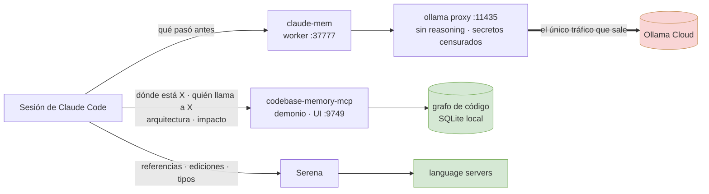

<h1 align="center">Claude Code Stack</h1>

<p align="center">
  <b>Memoria persistente e inteligencia real sobre el código para Claude Code — y la única regla que evita que compitan entre sí.</b>
</p>

<p align="center">
  
  
  
  
</p>

<p align="center">
  <a href="README.md">English</a> ·
  <a href="README.ru.md">Русский</a> ·
  <a href="README.zh-CN.md">中文</a> ·
  <b>Español</b>
</p>

---

Cuatro herramientas que le dan a Claude Code memoria capaz de sobrevivir a una sesión y un mapa estructural de tu código — más el `CLAUDE.md` global que le asigna a cada una su función. Instalado y verificado de principio a fin; lo que de verdad te interesa son los [tropiezos](#tropiezos), porque cada entrada costó tiempo real de depuración.

## Contenido

- [El stack](#el-stack) · [Cómo encaja todo](#cómo-encaja-todo) · [Por qué dos herramientas de código](#por-qué-dos-herramientas-de-código)
- [Instalación](#instalación) · [Verificación](#verificación)
- [**Prompts para pegar**](#prompts-para-pegar) ← empieza aquí tras instalar
- [Tropiezos](#tropiezos) · [Coste y consumo](#coste-y-consumo) · [Privacidad](#privacidad)

## El stack

| Herramienta | Qué aporta | Cómo corre |
|---|---|---|
| **[claude-mem](https://github.com/thedotmack/claude-mem)** | Memoria **conversacional** entre sesiones. Registra lo ocurrido e inyecta el trabajo pasado relevante al arrancar. | Worker local + SQLite + Chroma |
| **[claude-mem-ollama-proxy](https://github.com/limeflash/claude-mem-ollama-proxy)** | Redirige la generación de memoria de claude-mem a **Ollama Cloud**, desactiva el reasoning y **censura secretos** antes de que nada salga de la máquina. | Proxy local en `127.0.0.1:11435` |
| **[codebase-memory-mcp](https://github.com/DeusData/codebase-memory-mcp)** | **Grafo de conocimiento del código** persistente — funciones, cadenas de llamadas, rutas, enlaces entre repos. Respuestas de arquitectura en milisegundos. | Binario nativo + demonio |
| **[serena](https://github.com/oraios/serena)** | Navegación **LSP** en vivo por símbolos, referencias exactas y *edición* a nivel de símbolo. | Language servers por proyecto |

## Cómo encaja todo



Todo lo verde se queda en tu máquina. Lo único que sale es la generación de memoria, y pasa por el proxy que primero elimina las credenciales.

## Por qué dos herramientas de código

Instalar un grafo de código *y* un servidor LSP sin una regla hace que el agente dé bandazos: uno dice «lee el grafo», el otro «usa LSP». [`CLAUDE.md`](CLAUDE.md) lo zanja en una línea — **el grafo responde preguntas, Serena hace cambios**:

| Pregunta | Herramienta |
|---|---|
| ¿Dónde está esto? ¿Quién lo llama? ¿Cómo está construido? ¿Qué se rompe si lo cambio? | **grafo** — instantáneo, cubre todos los repos indexados, funciona entre repos |
| Referencias exactas antes de tocar un símbolo · la edición · errores de tipos después | **Serena** — lee el estado real en disco y puede modificar código |

Si el grafo y los archivos discrepan, **mandan los archivos**: reindexa en lugar de fiarte de una respuesta caduca.

## Instalación

El orden importa: el proxy modifica `~/.claude-mem/settings.json`, así que claude-mem debe existir antes.

### 1 · claude-mem

```powershell
npx claude-mem install
```

Elige el runtime **Worker**. Sirve cualquier proveedor compatible con OpenAI — el proxy lo sobrescribe en el paso 2 — así que lo más barato es pegar una clave de **Ollama** desde [ollama.com/settings/keys](https://ollama.com/settings/keys).

> El instalador puede terminar con `Fatal error: ENOENT ... .install-version` y un aviso `ERESOLVE` de npm. **Ambos son inofensivos** — ver [tropiezos](#tropiezos).

### 2 · Proxy de Ollama

```powershell
git clone https://github.com/limeflash/claude-mem-ollama-proxy.git
cd claude-mem-ollama-proxy
.\windows\install.ps1
```

En macOS/Linux: `./macos/install.sh`. Registra una tarea al iniciar sesión (sin permisos de administrador), apunta claude-mem a `http://127.0.0.1:11435/v1` y usa `deepseek-v4-flash:0731` por defecto. Otro modelo: `-Model "gpt-oss:120b"` — lista en `https://ollama.com/v1/models`.

Inyecta `reasoning_effort: "none"`. Sin eso, un modelo de razonamiento devuelve la respuesta en `reasoning`, deja `content` vacío y claude-mem no guarda nada sin avisar.

### 3 · codebase-memory-mcp

```powershell
Invoke-WebRequest -Uri https://raw.githubusercontent.com/DeusData/codebase-memory-mcp/main/install.ps1 -OutFile install.ps1
Unblock-File .\install.ps1
.\install.ps1
```

Binario nativo — **sin clave de API ni runtime**. La búsqueda semántica usa embeddings integrados; nada sale de la máquina. Configura automáticamente todos los agent CLI que detecta.

```powershell
codebase-memory-mcp daemon start
codebase-memory-mcp cli index_repository --repo-path C:\path\to\repo
codebase-memory-mcp cli list_projects
```

Indexa **cada repo por separado**. Una carpeta paraguas llena de `node_modules` y artefactos de build produce un amasijo inútil en vez de grafos limpios por proyecto.

### 4 · Serena

```powershell
uv tool install --from git+https://github.com/oraios/serena serena-agent
claude mcp add serena -s user -- serena start-mcp-server --context claude-code --project-from-cwd --enable-web-dashboard False
```

Para fijar una versión, añade `@v1.7.0` tras la URL. Para actualizar después usa `--force`; si no consigue borrar el directorio antiguo, ver [tropiezos](#tropiezos).

### 5 · Instrucciones globales

Copia [`CLAUDE.md`](CLAUDE.md) a `~/.claude/CLAUDE.md`. Se carga en cada sesión automáticamente, así que las reglas se aplican sin que digas nada.

Mantenlo **en inglés** aunque trabajes en otro idioma: es configuración que lee el agente, no documentación para ti.

## Verificación

```powershell
Get-ScheduledTask -TaskName claude-mem-ollama-proxy
Get-Content "$env:USERPROFILE\.claude-mem-proxy\proxy.log" -Tail 5
# línea sana: POST /v1/chat/completions -> 200 [reasoning_effort=none]

Invoke-WebRequest http://localhost:37777 -UseBasicParsing | Select-Object StatusCode

codebase-memory-mcp daemon status
codebase-memory-mcp cli list_projects        # UI: http://127.0.0.1:9749
```

En Claude Code, `/mcp` debería listar `serena` y `codebase-memory-mcp`. **Los servidores MCP solo se conectan al arrancar — reinicia Claude Code tras instalar.**

## Prompts para pegar

Cópialos directamente en una sesión. El idioma da igual — escribe como sueles hacerlo. Hay más en [`PROMPT.md`](PROMPT.md).

### Orientación — primer mensaje en un repo nuevo

```text
Esta máquina tiene dos servidores de inteligencia sobre el código. Úsalos en lugar de hacer grep del árbol
o leer archivos enteros. El grafo (codebase-memory-mcp) responde preguntas. Serena hace los cambios.

1. Llama primero a list_projects. Si este repo no está indexado, indéxalo con index_repository antes que nada.
   Si está indexado pero ha pasado algo grande fuera de esta sesión — git pull, cambio de rama, rebase, o el
   demonio estuvo caído — reindéxalo también: el watcher solo mantiene el grafo fresco mientras está
   corriendo, y un grafo caduco falla en silencio.
2. Para "dónde está X / quién llama a X / cómo está construido / qué se rompe si cambio X" usa
   get_architecture, search_graph, trace_path, query_graph, get_code_snippet. La búsqueda semántica es un
   modo de search_graph (semantic_query=["a","b"]), no una herramienta aparte. No recurras a Grep/Glob para
   preguntas estructurales.
3. Serena sostiene un solo proyecto a la vez. Si el archivo que vas a editar está fuera del directorio de
   trabajo de esta sesión, llama antes a activate_project("<ruta del repo>"); si no, los language servers
   activos son los equivocados. Después obtén las referencias exactas con find_referencing_symbols, edita con
   replace_symbol_body / insert_after_symbol / rename_symbol / safe_delete_symbol y ejecuta
   get_diagnostics_for_file.
4. Si el grafo y los archivos discrepan, mandan los archivos — reindexa en vez de fiarte de algo caduco.

Empieza con un resumen breve de la arquitectura de este repo a partir del grafo, y dime si algo de lo
anterior no estaba disponible.
```

Esa última frase importa: sin ella, un servidor MCP ausente se convierte en un agente que hace grep en silencio y finge que todo va bien.

### Comprobación de salud — cuando algo va raro

```text
Revisa mi instalación y dime qué está realmente roto, no qué debería estar:
- ¿está activo el demonio de codebase-memory-mcp y cuántos proyectos hay indexados?
- ¿está conectado serena?
- ¿responde el worker de claude-mem en http://localhost:37777?
- ¿muestra ~/.claude-mem-proxy/proxy.log líneas recientes "-> 200 [reasoning_effort=none]"?
Para cada fallo dame la causa y el arreglo — no te limites a reiniciar cosas.
```

### Montar una máquina nueva

```text
Lee el README de este repositorio y monta todo el stack en esta máquina, en el orden indicado.
Párate y avísame antes de cualquier cosa que requiera una clave de pago. Al terminar, ejecuta la
comprobación de salud y muéstrame el resultado.
```

### Indexar un lote de repos

```text
Indexa en el grafo de código todos los repositorios git dentro de <ruta>. Indexa cada repo por separado
— no indexes una carpeta padre que contenga varios — y omite esqueletos vacíos, archivos históricos y
carpetas que solo tengan artefactos de build o datasets. Después muéstrame la lista de proyectos con su
número de nodos y aristas.
```

## Evitar que claude-mem te bloquee

El hook `UserPromptSubmit` de claude-mem es **síncrono**. Cuando el worker no responde, sale con código distinto de cero y Claude Code **bloquea tu prompt** — visto de verdad: 77 prompts rechazados seguidos. El plugin marca sus hooks `PostToolUse`, `PreToolUse` y `Stop` como `"async": true`, que no pueden bloquear; justo el único que se interpone entre tú y tu teclado, no.

Y se atasca porque el fallo se retroalimenta: el worker muere, su socket de escucha en `:37777` sobrevive (heredado por un hijo vivo), el lanzador ve el puerto ocupado y registra `Port already in use, refusing to start duplicate`, nadie responde a los health checks, así que todos los hooks fallan — para siempre.

Dos capas, ambas en [`watchdog/`](watchdog):

**1. Endurecer los hooks — la garantía.** [`harden-hooks.js`](watchdog/harden-hooks.js) envuelve los hooks bloqueantes en una subshell:

```bash
node watchdog/harden-hooks.js ~/.claude/plugins/cache/thedotmack/claude-mem/<versión>/hooks/hooks.json
```

Un `exit 1` dentro del comando original ahora solo termina la subshell, y el `exit 0` final se ejecuta igual — así que un worker muerto te cuesta unas cuantas observaciones, no la capacidad de escribir. Es idempotente; repítelo tras actualizar el plugin, porque la caché se sobrescribe.

**2. Watchdog — la recuperación.** [`claude-mem-watchdog.ps1`](watchdog/claude-mem-watchdog.ps1) como tarea programada, cada 5 minutos: sondea `:37777` y, si no está sano, mata el worker colgado y lo relanza. También comprueba el proxy de Ollama en `:11435` — ese corre en una ventana de consola, así que un Ctrl+C accidental lo mata y a partir de ahí el worker sigue reportándose sano mientras cada petición de generación falla en silencio. No resucita el plugin si tú lo desactivaste, nunca toca tus sesiones de Claude Code, y omite al dueño del puerto salvo que sea realmente un worker de claude-mem — el proceso `.claude-mem-proxy` cae dentro de un filtro ingenuo `*claude-mem*` y no debe morir.

```powershell
$s = "$env:USERPROFILE\.claude-mem-watchdog\watchdog.ps1"
$a = New-ScheduledTaskAction -Execute powershell.exe -Argument "-NoProfile -ExecutionPolicy Bypass -WindowStyle Hidden -File `"$s`""
$t = New-ScheduledTaskTrigger -Once -At (Get-Date).AddMinutes(1) -RepetitionInterval (New-TimeSpan -Minutes 5)
Register-ScheduledTask -TaskName claude-mem-watchdog -Action $a -Trigger $t
```

**Cuando el PID dueño del puerto está muerto**, el descriptor lo heredó un hijo que sobrevivió al worker. En la práctica ese hijo es el propio stack Chroma de claude-mem — `chroma-mcp.exe` y sus workers de python — huérfanos desde que murió el worker, y **no** una sesión del editor. El watchdog mata esos, y luego demuestra que el puerto quedó realmente libre con un bind de verdad antes de relanzar; una línea `LISTENING` en `netstat` no prueba nada en ninguna dirección. Si algo que no puede identificar sigue ocupando el puerto, lo registra y se detiene en vez de matar procesos al azar.

## Tropiezos

Todos estos ocurrieron de verdad.

| Síntoma | Causa | Solución |
|---|---|---|
| `npx claude-mem install` acaba con `Fatal error: ENOENT ... marketplaces\thedotmack\plugin\.install-version` | Fallo cosmético de rutas — el archivo se escribe un nivel más arriba | **Ignóralo.** Comprueba que la caché del plugin tiene `node_modules` y que el MCP responde |
| …y un conflicto `ERESOLVE` de npm con tree-sitter | Instalación redundante de gramáticas **solo de desarrollo**; las dependencias de runtime ya las instaló `bun` | **Ignóralo** |
| La generación de memoria cuesta una fortuna | Las rutas por defecto cobran por observación (Haiku ≈ 58 $/mil, OpenRouter ≈ 8 $/mil) | Usa el proxy — la generación pasa a tu saldo de Ollama Cloud |
| claude-mem no guarda nada y no muestra error | El modelo de razonamiento puso el texto en `reasoning` y dejó `content` vacío | El `reasoning_effort: "none"` del proxy |
| La instalación de `codebase-memory-mcp` sale con código 1 y el PATH nunca se registra | El fallo de la configuración de un solo agente aborta toda la activación. Una config de **Hermes** en `%LOCALAPPDATA%\hermes\config.yaml` falla de forma determinista, sea cual sea su contenido — [issue #1656](https://github.com/DeusData/codebase-memory-mcp/issues/1656) | Borra o renombra ese directorio, o añade el directorio de instalación al PATH a mano. El resto de agentes se configuran bien |
| `daemon status` dice "not running" mientras la UI en :9749 responde | Demonios en competencia, normalmente por repetir `install --force` | `daemon stop`, mata los `codebase-memory-mcp.exe` que queden y lanza `daemon start` una vez |
| Las respuestas del grafo parecen caducas | `auto_watch=true` refresca los proyectos **ya indexados**, pero `auto_index=false` — los repos nuevos nunca se recogen solos | Ejecuta `index_repository` una vez por repo nuevo |
| **Los prompts dejan de enviarse**: `A hook blocked your prompt … claude-mem worker unreachable for N consecutive hooks` | El worker murió, su socket en `:37777` sobrevivió, el lanzador se niega a crear un duplicado, los health checks fallan — y el hook síncrono `UserPromptSubmit` bloquea la entrada. Se retroalimenta | Desactiva el plugin para volver a escribir y aplica [`watchdog/`](watchdog). Ver [la sección anterior](#evitar-que-claude-mem-te-bloquee) |
| Un puerto muestra un listener cuyo PID no existe (`taskkill: process not found`) | Socket huérfano — un hijo heredó el descriptor y sobrevivió a su dueño. En claude-mem el culpable es su propio `chroma-mcp.exe` y sus workers de python, aún vivos tras la muerte del worker | Mata esos ayudantes y confirma con un bind real (`[System.Net.Sockets.TcpListener]`) — `netstat` sigue listando el fantasma hasta que se cierra el último descriptor. No hace falta reiniciar |
| Serena falla con `Cannot extract symbols from <archivo>. Active language servers: ['python']` en un archivo TypeScript (u otro) | **No es falta de soporte del lenguaje.** Serena sostiene un proyecto a la vez y se ancla al directorio de trabajo de la sesión, así que solo están levantados los language servers de ese proyecto | `activate_project("<ruta del repo>")` y reintenta. Verificado: al activar un repo TS arranca el servidor `typescript` y la extracción de símbolos funciona |
| El agente afirma que `semantic_query` / `activate_project` «no existen» | `semantic_query` es un **parámetro de `search_graph`**, no una herramienta, así que buscarlo en la lista de herramientas falla. `activate_project` sí existe; una búsqueda por palabras clave simplemente lo posiciona mal | Usa `search_graph(semantic_query=["a","b"])`; selecciona `activate_project` por su nombre exacto |
| `detect_changes` devuelve `seed_symbols: 0` pese a haber muchos archivos cambiados | Compara contra `base_branch` (por defecto `main`) o `since` — los cambios sin commitear del árbol de trabajo no resuelven a símbolos | Haz commit primero, pasa el `base_branch`/`since` correcto, o usa `trace_path` para el radio de impacto |
| `uv tool install --force` falla: *"failed to remove directory … reparse point … (os error 4395)"* | Error engañoso — normalmente no hay ningún reparse point. Detén todos los `serena.exe`; si persiste, hay que borrar el directorio a la fuerza | `robocopy <dir-vacío> <dir-herramienta> /MIR`, luego `rmdir /s /q` y reinstala |
| **Todos los plugins aparecen `Disabled` de golpe y no se pueden reactivar** | Algo reescribió `~/.claude/settings.json` con un **BOM** UTF-8 — exactamente lo que hace `Set-Content -Encoding UTF8` en PowerShell 5.1. Un `EF BB BF` inicial hace que un parser JSON estricto rechace el archivo entero, así que ninguna opción se aplica | Reescríbelo sin BOM: `node -e "const f=require('fs'),p='<archivo>';let s=f.readFileSync(p,'utf8');if(s.charCodeAt(0)===0xFEFF)s=s.slice(1);f.writeFileSync(p,JSON.stringify(JSON.parse(s),null,2))"`. Nunca pases la configuración de Claude por `Set-Content -Encoding UTF8`; usa `[System.IO.File]::WriteAllText($p,$json,(New-Object System.Text.UTF8Encoding($false)))` |
| Un script de PowerShell 5.1 muere con *"The property cannot be found on this object"* | En 5.1, `$json.NewKey = value` lanza excepción para claves ausentes en un objeto de `ConvertFrom-Json` | `Add-Member -NotePropertyName ... -Force` |
| Una variable de ruta se convierte en algo como `MSFT_TaskSettings3` | Los nombres de variable en PowerShell **no distinguen mayúsculas** — `$settings` pisa silenciosamente a `$Settings` | Renombra una de las dos |
| La salida de un `.exe` nativo aparece en rojo como `NativeCommandError` | PowerShell envuelve así el stderr de un programa nativo; el programa no falló | Mira el código de salida, no el color |

## Coste y consumo

**codebase-memory-mcp** y **Serena** son gratis y totalmente locales. Solo **claude-mem** cobra por observación — con el proxy, eso sale de tu saldo de Ollama Cloud.

| | Disco | Memoria |
|---|---|---|
| codebase-memory-mcp | binario de 282 MB + caché del grafo (~450 MB para 19 repos / 111 mil nodos) | un demonio |
| Serena | poco | ~1,6 GB con los language servers y varias sesiones abiertas |
| claude-mem | SQLite + Chroma, crece con el uso | worker + stack de embeddings |

## Privacidad

El grafo y Serena son totalmente locales. claude-mem **sí** envía contenido de la conversación a un modelo — el proxy revisa los cuerpos de los mensajes y sustituye las credenciales por `[SECRET:{type}]` antes de reenviar, registrando `[redacted: ...]` cuando actúa. Mantén `CMP_REDACT` activado.

## Licencia

[MIT](LICENSE). Las cuatro herramientas documentadas tienen sus propias licencias.
