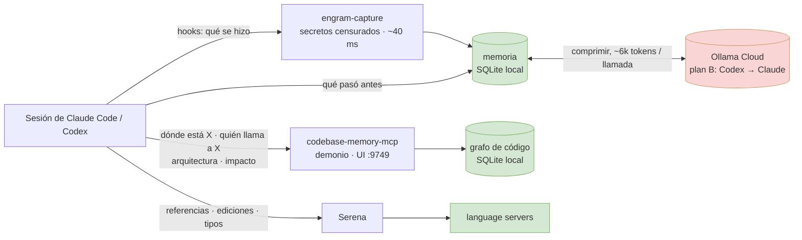

<h1 align="center">Claude Code Stack</h1>

<p align="center">
  <b>Memoria persistente e inteligencia real sobre el código para Claude Code — y la única regla que evita que compitan entre sí.</b>
</p>

<p align="center">
  
  
  
  
</p>

<p align="center">
  <a href="README.md">English</a> ·
  <a href="README.ru.md">Русский</a> ·
  <a href="README.zh-CN.md">中文</a> ·
  <b>Español</b>
</p>

---

Tres herramientas que le dan a Claude Code memoria capaz de sobrevivir a una sesión y un mapa estructural de tu código — más el `CLAUDE.md` global que le asigna a cada una su función. Instalado y verificado de principio a fin; lo que de verdad te interesa son los [tropiezos](#tropiezos), porque cada entrada costó tiempo real de depuración.

## Contenido

- [El stack](#el-stack) · [Cómo encaja todo](#cómo-encaja-todo) · [Por qué dos herramientas de código](#por-qué-dos-herramientas-de-código)
- [Instalación](#instalación) · [Verificación](#verificación)
- [**Prompts para pegar**](#prompts-para-pegar) ← empieza aquí tras instalar
- [**Cómo elegir el modelo**](#cómo-elegir-el-modelo) — medido, no supuesto
- [**Por qué dejamos claude-mem**](#por-qué-dejamos-claude-mem) — lo que enseñaron dos meses con él
- [Tropiezos](#tropiezos) · [Coste y consumo](#coste-y-consumo) · [Privacidad](#privacidad)

## El stack

| Herramienta | Qué aporta | Cómo corre |
|---|---|---|
| **[quipu](https://github.com/limeflash/quipu)** | Memoria entre sesiones **que se escribe sola**. Los hooks registran lo que hizo el agente, un modelo barato en la nube lo comprime en unos pocos registros y la siguiente sesión en el mismo repo arranca con ellos. Es un fork de [engram](https://github.com/Gentleman-Programming/engram), así que el agente también puede buscar y guardar por su cuenta. | Un binario en Go + SQLite, dentro del servidor MCP |
| **[codebase-memory-mcp](https://github.com/DeusData/codebase-memory-mcp)** | **Grafo de conocimiento del código** persistente — funciones, cadenas de llamadas, rutas, enlaces entre repos. Respuestas de arquitectura en milisegundos. | Binario nativo + demonio |
| **[serena](https://github.com/oraios/serena)** | Navegación **LSP** en vivo por símbolos, referencias exactas y *edición* a nivel de símbolo. | Language servers por proyecto |

## Cómo encaja todo


```mermaid
flowchart LR
    CC["Sesión de Claude Code / Codex"]

    CC -->|"hooks: qué se hizo"| CAP["engram-capture<br/>secretos censurados · ~40 ms"]
    CAP --> MEM[("memoria<br/>SQLite local")]
    MEM <-->|"comprimir, ~6k tokens / llamada"| OC[("Ollama Cloud<br/>plan B: Codex → Claude")]
    CC -->|"qué pasó antes"| MEM

    CC -->|"dónde está X · quién llama a X<br/>arquitectura · impacto"| CBM["codebase-memory-mcp<br/>demonio · UI :9749"]
    CBM --> GR[("grafo de código<br/>SQLite local")]

    CC -->|"referencias · ediciones · tipos"| SR["Serena"]
    SR --> LS["language servers"]

    style OC fill:#f9d5d5,stroke:#c96
    style MEM fill:#d5e8d4,stroke:#82b366
    style GR fill:#d5e8d4,stroke:#82b366
    style LS fill:#d5e8d4,stroke:#82b366
```

Todo lo verde se queda en tu máquina. Lo único que sale es la compresión de la memoria, y las credenciales se eliminan en el hook, antes de que el evento llegue siquiera a escribirse en disco.

## Por qué dos herramientas de código

Instalar un grafo de código *y* un servidor LSP sin una regla hace que el agente dé bandazos: uno dice «lee el grafo», el otro «usa LSP». [`CLAUDE.md`](CLAUDE.md) lo zanja en una línea — **el grafo responde preguntas, Serena hace cambios**:

| Pregunta | Herramienta |
|---|---|
| ¿Dónde está esto? ¿Quién lo llama? ¿Cómo está construido? ¿Qué se rompe si lo cambio? | **grafo** — instantáneo, cubre todos los repos indexados, funciona entre repos |
| Referencias exactas antes de tocar un símbolo · la edición · errores de tipos después | **Serena** — lee el estado real en disco y puede modificar código |

Si el grafo y los archivos discrepan, **mandan los archivos**: reindexa en lugar de fiarte de una respuesta caduca.

La memoria responde a otra pregunta — *qué hicimos y decidimos antes* — así que no compite con ninguna de las dos.

## Instalación

### 1 · quipu (memoria)

Se compila desde el código fuente; requiere Go 1.25+.

```powershell
git clone https://github.com/limeflash/quipu.git
cd quipu
$bin = "$env:LOCALAPPDATA\Programs\engram"
go build -o "$bin\engram.exe" ./cmd/engram
go build -ldflags "-s -w" -o "$bin\engram-capture.exe" ./cmd/engram-capture
[Environment]::SetEnvironmentVariable('Path', [Environment]::GetEnvironmentVariable('Path','User') + ";$bin", 'User')   # lo verán las terminales nuevas

New-Item -ItemType Directory -Force "$HOME\.engram" | Out-Null
Set-Content "$HOME\.engram\autocapture.json" '{}'      # activa la captura
Set-Content "$HOME\.engram\ollama.key" '<tu clave>'    # de ollama.com/settings/keys
```

El binario conserva el nombre de engram. Después:

- fusiona [`docs/fork/claude-settings.json`](https://github.com/limeflash/quipu/blob/main/docs/fork/claude-settings.json) en `~/.claude/settings.json` — captura en `PostToolUse` / `UserPromptSubmit` / `Stop`, memoria en `SessionStart`;
- registra el servidor MCP (conjunto de herramientas de solo lectura — el agente lee la memoria sin que nadie le insista en escribirla):

```powershell
claude mcp add engram -s user -- "$env:LOCALAPPDATA\Programs\engram\engram.exe" mcp --tools=mem_search,mem_context,mem_get_observation,mem_timeline,mem_current_project,mem_list_projects
```

- **Codex** también: añade [`docs/fork/codex-config.toml`](https://github.com/limeflash/quipu/blob/main/docs/fork/codex-config.toml) a `~/.codex/config.toml` y aprueba los hooks nuevos una vez en un `codex` interactivo.
- **Planes B** cuando se agota la cuota de Ollama: Codex sirve si `codex` tiene la sesión iniciada; para Claude, guarda la salida de `claude setup-token` en `~/.engram/claude.token`.
- **Si vienes de claude-mem:** `engram import claude-mem --dry-run --root <carpeta de tus repos>` y luego lo mismo sin `--dry-run`.

Todo lo demás — configuración, comandos, cómo se ordenan los registros — está en el [README de quipu](https://github.com/limeflash/quipu#readme).

### 2 · codebase-memory-mcp

```powershell
Invoke-WebRequest -Uri https://raw.githubusercontent.com/DeusData/codebase-memory-mcp/main/install.ps1 -OutFile install.ps1
Unblock-File .\install.ps1
.\install.ps1
```

Binario nativo — **sin clave de API ni runtime**. La búsqueda semántica usa embeddings integrados; nada sale de la máquina. Configura automáticamente todos los agent CLI que detecta.

```powershell
codebase-memory-mcp daemon start
codebase-memory-mcp cli index_repository --repo-path C:\path\to\repo
codebase-memory-mcp cli list_projects
```

Indexa **cada repo por separado**. Una carpeta paraguas llena de `node_modules` y artefactos de build produce un amasijo inútil en vez de grafos limpios por proyecto.

### 3 · Serena

```powershell
uv tool install --from git+https://github.com/oraios/serena@9f9db76622340930d66aba9f72a2349b30bb1e29 serena-agent
claude mcp add serena -s user -- serena start-mcp-server --context claude-code --project-from-cwd --enable-web-dashboard False
```

**No quites el pin.** Es el último commit de la línea 1.x (2026-09-06, versión `1.7.1.dev0`). Desde el 2026-09-15 el `main` de Serena es la `2.0.0.dev0` aún sin publicar: allí `activate_project` exige un `session_id` que las reglas de [`CLAUDE.md`](CLAUDE.md) no pasan, y la aplicación pasa a licencia GPL-3.0. Mueve el pin cuando salga la 2.0 y las reglas estén adaptadas. Para reinstalar o actualizar usa `--force`; si no consigue borrar el directorio antiguo, ver [tropiezos](#tropiezos).

### 4 · Instrucciones globales

Copia [`CLAUDE.md`](CLAUDE.md) a `~/.claude/CLAUDE.md`. Se carga en cada sesión automáticamente, así que las reglas se aplican sin que digas nada.

Mantenlo **en inglés** aunque trabajes en otro idioma: es configuración que lee el agente, no documentación para ti.

## Verificación

```powershell
engram autocapture probe         # una llamada mínima a cada modelo de la cadena: "ok" por línea
engram autocapture status        # el spool debe vaciarse a 0; llamadas / tokens / registros por día

codebase-memory-mcp daemon status
codebase-memory-mcp cli list_projects        # UI: http://127.0.0.1:9749
```

En Claude Code, `/mcp` debería listar `engram`, `serena` y `codebase-memory-mcp`, y una sesión nueva en un repo indexado debería abrirse con un bloque `<engram-memory project="…">` en cuanto haya algo que recordar. **Los servidores MCP solo se conectan al arrancar — reinicia Claude Code tras instalar.**

## Prompts para pegar

Cópialos directamente en una sesión. El idioma da igual — escribe como sueles hacerlo. Hay más en [`PROMPT.md`](PROMPT.md).

### Orientación — primer mensaje en un repo nuevo

```text
Esta máquina tiene dos servidores de inteligencia sobre el código. Úsalos en lugar de hacer grep del árbol
o leer archivos enteros. El grafo (codebase-memory-mcp) responde preguntas. Serena hace los cambios.

1. Llama primero a list_projects. Si este repo no está indexado, indéxalo con index_repository antes que nada.
   Si está indexado pero ha pasado algo grande fuera de esta sesión — git pull, cambio de rama, rebase, o el
   demonio estuvo caído — reindéxalo también: el watcher solo mantiene el grafo fresco mientras está
   corriendo, y un grafo caduco falla en silencio.
2. Para "dónde está X / quién llama a X / cómo está construido / qué se rompe si cambio X" usa
   get_architecture, search_graph, trace_path, query_graph, get_code_snippet. La búsqueda semántica es un
   modo de search_graph (semantic_query=["a","b"]), no una herramienta aparte. No recurras a Grep/Glob para
   preguntas estructurales.
3. Serena sostiene un solo proyecto a la vez. Si la sesión arrancó dentro de un repo, queda ligada a él hasta el
   final: activate_project está desactivado a propósito y los archivos de otros repos quedan fuera de su alcance.
   Si arrancó fuera de cualquier repo, llama a activate_project("<ruta del repo>") antes de la primera búsqueda.
   Después obtén las referencias exactas con find_referencing_symbols, edita con
   replace_symbol_body / insert_after_symbol / rename_symbol / safe_delete_symbol y ejecuta
   get_diagnostics_for_file.
4. Si el grafo y los archivos discrepan, mandan los archivos — reindexa en vez de fiarte de algo caduco.

Empieza con un resumen breve de la arquitectura de este repo a partir del grafo, y dime si algo de lo
anterior no estaba disponible.
```

Esa última frase importa: sin ella, un servidor MCP ausente se convierte en un agente que hace grep en silencio y finge que todo va bien.

### Comprobación de salud — cuando algo va raro

```text
Revisa mi instalación y dime qué está realmente roto, no qué debería estar:
- ¿está activo el demonio de codebase-memory-mcp y cuántos proyectos hay indexados?
- ¿están conectados serena y engram?
- ¿pasa `engram autocapture probe` y muestra `engram autocapture status` el spool vaciándose
  y llamadas recientes a los modelos sin errores?
Para cada fallo dame la causa y el arreglo — no te limites a reiniciar cosas.
```

### Recuerdo — qué pasó antes

```text
Antes de empezar: busca en la memoria qué se hizo y qué se decidió sobre <tema> en este proyecto, y en otros
proyectos si aquí no está (mem_search con all_projects=true). Abre completos los registros más relevantes y
dime qué sigue vigente — si discrepan, manda el código.
```

### Montar una máquina nueva

```text
Lee el README de este repositorio y monta todo el stack en esta máquina, en el orden indicado.
Párate y avísame antes de cualquier cosa que requiera una clave de pago. Al terminar, ejecuta la
comprobación de salud y muéstrame el resultado.
```

### Indexar un lote de repos

```text
Indexa en el grafo de código todos los repositorios git dentro de <ruta>. Indexa cada repo por separado
— no indexes una carpeta padre que contenga varios — y omite esqueletos vacíos, archivos históricos y
carpetas que solo tengan artefactos de build o datasets. Después muéstrame la lista de proyectos con su
número de nodos y aristas.
```

## Mantener vivo el grafo de código

El daemon de `codebase-memory-mcp` necesita un mantenimiento deliberado para seguir vivo, y aquí está la trampa: su daemon y su CLI se encuentran mediante una tubería con nombre cuyo nombre es un hash del contexto de arranque.

```
arrancado por el Programador de tareas : cbm-daemon-bc0bed48…
arrancado desde una sesión             : cbm-daemon-2a438ffc…
```

Por eso un daemon lanzado desde una tarea programada funciona perfectamente, ocupa el puerto de la UI y es **permanentemente invisible**: `daemon status` dice "not running" junto a un proceso vivo. Entonces la CLI levanta un daemon desechable por cada comando, esos compiten entre sí, el registro se atasca y la lista de proyectos sale vacía. Los archivos `.db` de cada proyecto nunca se ven afectados; lo que se rompe es el registro.

Así que lo mantiene vivo un **hook SessionStart de Claude Code**, que corre en el contexto donde el nombre de la tubería sí coincide: [`ensure-cbm-daemon.ps1`](hooks/ensure-cbm-daemon.ps1) tras el envoltorio "dispara y olvida" [`cbm-daemon-ensure.cmd`](hooks/cbm-daemon-ensure.cmd). Copia ambos a `~/.claude/hooks/` y registra el envoltorio en cada matcher `SessionStart` de `~/.claude/settings.json`:

```json
{ "type": "command", "command": "cmd.exe /d /v:off /s /c '\"\"%USERPROFILE%\\.claude\\hooks\\cbm-daemon-ensure.cmd\"\"'", "timeout": 10 }
```

El envoltorio devuelve en ~40 ms con código 0 — desacopla el trabajo real, así que una reparación lenta o fallida nunca puede retrasar ni bloquear una sesión. Y como solo corre al iniciar una sesión, el daemon existe justo cuando algo lo necesita. Solo se detienen los procesos que llevan la marca del daemon; los que no la llevan son servidores MCP de sesiones abiertas. Registra lo que hace en `~/.claude/hooks/cbm-daemon.log`.

## Cómo elegir el modelo

**Usa `deepseek-v4.1-flash`** — el valor por defecto de quipu, con `glm-5.3-flash` como respaldo. Se midió, no se supuso: ocho sesiones reales de esta máquina con la respuesta correcta conocida, puntuadas según si el resumen conservó el hecho que importaba.

| | **deepseek-v4.1-flash** | glm-5.3-flash | deepseek-v4-flash:0731 (retirado) |
|---|---|---|---|
| Hechos conservados | **10/10** | 10/10 | 7/10 |
| Tokens por llamada | **~62** | ~480 | ~44 |
| Latencia | **0,6 s** | 5,2 s | 0,9 s |
| Cuota de sesión por llamada | **< 0,007%** | ~0,020% | — |

El `0731` retirado perdía el número `266` de «273 intentos, 266 fallos, 5 éxitos» y se contradecía, y en la sesión que costó dos horas entender omitió que el apagado era **por diseño**, que era todo el hallazgo. `glm-5.3-flash` lo corrigió; `deepseek-v4.1-flash` conserva los mismos hechos con una octava parte de tokens y latencia y como mucho un tercio de la cuota, y leído a mano es incluso más limpio: GLM se inventó «on locked dirs» en un resumen.

### Los modelos que razonan necesitan el endpoint nativo

El `/v1/chat/completions` compatible con OpenAI de Ollama no acepta el parámetro `think` ([ollama#15288](https://github.com/ollama/ollama/issues/15288), [#15293](https://github.com/ollama/ollama/issues/15293)), así que un modelo que razona o narra dentro de `content` —1300–1600 caracteres de «The user wants me to compress…»— o devuelve `content` vacío. quipu habla únicamente con el `/api/chat` nativo, con `think: false` — salvo los prefijos de modelo listados en `ollama.think` (por defecto `glm-`), que reciben `think: true`: eso pone la deliberación en su propio campo `thinking` y deja `content` para la respuesta, mientras que `false` se limita a reinsertar la cháchara. Además, Ollama ignora el esquema JSON de `format`, así que la respuesta se valida en local y tiene una ronda de reparación.

### Cuánto cuesta en realidad, y en qué se equivocó este repo

Ollama Cloud es una suscripción: los tokens no son dinero. Lo que se agota es la **cuota**: un límite de sesión de 5 horas y uno semanal, ponderados por modelo y no por token, compartidos por todos los modelos de la cuenta.

Una versión anterior de esta sección leyó un 0,5% de uso semanal y prometió «~1% con GLM, unas 100× de margen». **Era falso.** La lectura se tomó justo después de reiniciarse la ventana semanal —el contador marcaba solo 271 peticiones— y se extrapoló desde ahí. Una semana con GLM produjo 4.386 peticiones de GLM y 1.990 de otros, y la cuota semanal llegó al **100%**:

```
          200     429 (cuota)   410 (modelo retirado)
09-19     863        6.876            0
09-24     207       26.109            0
09-25       1       21.142        6.427
```

Como la cuota es de toda la cuenta, todos los modelos respondieron 429 a la vez, el modelo de respaldo no sirvió de nada, y claude-mem siguió reintentando —hasta 26.000 llamadas rechazadas al día— mientras la memoria dejó de escribirse casi una semana. Por eso quipu nunca reintenta en bucle un modelo que lo ha rechazado: un 429 bloquea ese modelo durante 15 minutos, que se duplican hasta un máximo de 2 horas, y el lote pasa al siguiente de la cadena. El segundo modelo de Ollama normalmente también rechaza —la cuota es de toda la cuenta—, así que el trabajo acaba en **Codex** (`gpt-6-luna`, tu plan de ChatGPT) y después en **Claude** (`claude-sonnet-5-5`, tu plan de Claude), cada uno limitado a 20 llamadas por hora. Un 410 —el proveedor retiró el modelo— lo desactiva para siempre. `engram autocapture status` muestra en qué punto está cada modelo.

## Por qué dejamos claude-mem

Hasta octubre de 2026 este stack usó [claude-mem](https://github.com/thedotmack/claude-mem) detrás de un [proxy](https://github.com/limeflash/claude-mem-ollama-proxy) (ahora archivado) que trasladaba la generación a Ollama Cloud y censuraba los secretos, más un watchdog que mantenía vivo su worker. Funcionaba —solo el proxy eliminó **4.192 credenciales** en dos semanas que de otro modo se habrían enviado literalmente a un modelo de terceros—, pero cada pieza de esa lista existía para parchear algo:

- su hook síncrono `UserPromptSubmit` **bloqueaba los prompts** cuando el worker moría — una vez, 77 rechazados seguidos;
- el socket del worker muerto lo heredaban procesos de Chroma huérfanos, así que el worker no podía reiniciarse, y el watchdog tuvo que aprender a distinguirlo de un apagado normal por inactividad — se equivocó **273 veces** en dos semanas, haciendo parpadear una ventana de consola cada cinco minutos;
- la base de datos creció hasta gigabytes por un outbox de sincronización en la nube que nadie usaba;
- cada llamada de generación enviaba **~150k tokens de entrada** de historial acumulado; el 5 de octubre eso sumó **2.700 millones** de tokens en un solo día.

quipu lo sustituye todo por hooks que escriben un archivo y terminan, compresión dentro del servidor MCP que ya está corriendo y llamadas sin estado. Medido sobre las mismas cuatro sesiones el 7 de octubre — claude-mem hasta que se apagó, quipu después:

| | claude-mem | quipu |
|---|---|---|
| registros por hora de trabajo | 270–330 | 36–66 |
| notas que solo recuentan código que se leyó | 65% | 29% |
| tokens de entrada ese día | 343,6 M (media 152k / llamada) | 0,72 M (media 6,4k / llamada) |
| auditoría a ciegas de 60 registros al azar: útiles / ruido / duplicados | 14 / 45 / 1 | 45 / 11 / 4 |

claude-mem seguía produciendo más registros útiles por hora en términos absolutos (~70 frente a ~37) — enterrados bajo tres registros de ruido cada uno. Todo el historial de claude-mem (49 mil registros, 1,5 mil resúmenes, 3,1 mil prompts) se importó con `engram import claude-mem`, así que en el cambio no se perdió nada.

## Tropiezos

Todos estos ocurrieron de verdad.

| Síntoma | Causa | Solución |
|---|---|---|
| Los hooks nuevos de quipu no hacen nada en **Codex** | Codex ejecuta un hook nuevo o modificado solo después de que confíes en él una vez | Abre un `codex` interactivo y aprueba los hooks |
| `codex exec` escribe eventos pero nunca un resumen del turno | `codex exec` termina antes de que acabe un hook Stop `async` | Deja `Stop` síncrono — la configuración incluida ya lo hace |
| Falla el comando de un hook de Codex con comillas o espacios | Codex ejecuta los comandos de los hooks a través de `cmd.exe` por defecto | Usa una ruta simple sin comillas, como en la configuración incluida |
| Recompilar `engram.exe` falla con "access denied" | Cada sesión de Claude Code y de Codex mantiene el binario abierto a través de su servidor MCP; Windows se niega a sobrescribir un `.exe` en ejecución | Renombra el viejo y luego copia el nuevo — renombrar una imagen en ejecución está permitido. Borra los `*.old-*.exe` cuando se reinicien las sesiones |
| El plan B de Claude responde `401` | Dentro de una sesión de Claude Code, el `claude -p` hijo hereda variables `ANTHROPIC_*` / `CLAUDE*` que apuntan a las credenciales del padre | quipu las limpia y usa solo `~/.engram/claude.token`, de `claude setup-token` |
| Un hook PostToolUse añade un retraso visible en Windows | El arranque del proceso crece con el tamaño de la imagen: ~110 ms para un binario de 30 MB, 19 ms para uno de 2 MB | Por eso la captura es un `engram-capture` aparte de 3 MB; mantén los hooks `async` |
| La instalación de `codebase-memory-mcp` sale con código 1 y el PATH nunca se registra | El fallo de la configuración de un solo agente aborta toda la activación. Una config de **Hermes** en `%LOCALAPPDATA%\hermes\config.yaml` falla de forma determinista, sea cual sea su contenido — [issue #1656](https://github.com/DeusData/codebase-memory-mcp/issues/1656) | Borra o renombra ese directorio, o añade el directorio de instalación al PATH a mano. El resto de agentes se configuran bien |
| `daemon status` dice "not running" mientras la UI en :9749 responde | Demonios en competencia, normalmente por repetir `install --force` | `daemon stop`, mata los `codebase-memory-mcp.exe` que queden y lanza `daemon start` una vez |
| **La UI del grafo no lista ningún proyecto**, o `daemon status` dice "not running" mientras un `codebase-memory-mcp.exe` está claramente vivo y sirviendo `:9749` | El daemon se arrancó desde un contexto cuyo hash de nombre de tubería difiere del de la CLI — el Programador de tareas es el sospechoso habitual. Corre y nunca se encuentra, así que cada llamada de la CLI levanta un daemon desechable y esos compiten hasta atascar el registro | Tus datos están bien: los `.db` por proyecto están intactos. Mata todo proceso marcado `--cbm-daemon-internal` (nunca los que no lo llevan, esos son servidores MCP de sesiones abiertas) y luego `daemon start` **desde una terminal dentro de una sesión**. Automatízalo con el [hook SessionStart](#mantener-vivo-el-grafo-de-código) |
| Las respuestas del grafo parecen caducas | `auto_watch=true` refresca los proyectos **ya indexados**, pero `auto_index=false` — los repos nuevos nunca se recogen solos | Ejecuta `index_repository` una vez por repo nuevo |
| `codebase-memory-mcp cli …` se queda colgado para siempre al 0% de CPU cuando lo lanza un agente | La CLI también lee sus argumentos JSON de stdin (`echo '<json>' \| codebase-memory-mcp cli <tool>`) y, cuando stdin no es una terminal, espera un EOF — que la herramienta de shell del agente nunca envía. Medido: 4 s con stdin cerrado, 16 s con stdin abierto durante 15 s | Cierra stdin: `codebase-memory-mcp cli list_projects < /dev/null`. Visto desde Claude Code en macOS |
| Tras actualizar `codebase-memory-mcp` a 0.11 y reindexar, cada repo aparece dos veces | 0.11 nombra los proyectos por su ruta completa (la raíz con `/` cambiado por `-`, p. ej. `Users-<you>-Projects-<repo>`) en vez del nombre de la carpeta, así que reindexar crea un proyecto nuevo junto al viejo, cuyo grafo caduco sigue apareciendo en las búsquedas | `delete_project --project <nombre-viejo>` para cada duplicado de nombre corto. Solo contienen datos derivados del grafo; si guardaste ADRs con `manage_adr`, sácalos antes. Para actualizar, vuelve a ejecutar el instalador del paso 2: `update` solo remite a una copia local suya que las instalaciones anteriores a 0.11 nunca dejaron |
| Un puerto muestra un listener cuyo PID no existe (`taskkill: process not found`) | Socket huérfano — un hijo heredó el descriptor y sobrevivió a su dueño | Mata a los hijos que sigan vivos y confirma con un bind real (`[System.Net.Sockets.TcpListener]`) — `netstat` sigue listando el fantasma hasta que se cierra el último descriptor. No hace falta reiniciar |
| Serena falla con `Cannot extract symbols from <archivo>. Active language servers: ['python']` en un archivo TypeScript (u otro) | **No es falta de soporte del lenguaje.** Serena sostiene un proyecto a la vez y se ancla al directorio de trabajo de la sesión, así que solo están levantados los language servers de ese proyecto | Sesión arrancada fuera de cualquier repo: `activate_project("<ruta del repo>")` y reintenta — verificado, al activar un repo TS arranca el servidor `typescript` y la extracción de símbolos funciona. Arrancada dentro de un repo: esa sesión no puede tener otro proyecto (fila siguiente) — abre una sesión en el otro repo |
| El agente afirma que `semantic_query` / `activate_project` «no existen» | `semantic_query` es un **parámetro de `search_graph`**, no una herramienta, así que buscarlo en la lista de herramientas falla. `activate_project` solo existe en una sesión arrancada **fuera** de cualquier repo, donde una búsqueda por palabras clave simplemente lo posiciona mal. Dentro de un repo, el contexto `claude-code` es de proyecto único (`single_project: true`) y lo elimina a propósito: 21 herramientas en vez de 23 | Usa `search_graph(semantic_query=["a","b"])`; selecciona `activate_project` por su nombre exacto. Si de verdad no está, la sesión está ligada a su repo: trabaja con otro repo desde una sesión arrancada en él |
| `detect_changes` devuelve `seed_symbols: 0` pese a haber muchos archivos cambiados | Compara contra `base_branch` (por defecto `main`) o `since` — los cambios sin commitear del árbol de trabajo no resuelven a símbolos | Haz commit primero, pasa el `base_branch`/`since` correcto, o usa `trace_path` para el radio de impacto |
| `uv tool install --force` falla: *"failed to remove directory … reparse point … (os error 4395)"* | Error engañoso — normalmente no hay ningún reparse point. Detén todos los `serena.exe`; si persiste, hay que borrar el directorio a la fuerza | `robocopy <dir-vacío> <dir-herramienta> /MIR`, luego `rmdir /s /q` y reinstala |
| Tras reinstalar, `serena --version` muestra `2.0.0.dev0` y `activate_project` exige un `session_id` | Una instalación sin pin toma el `main` de Serena, que desde el 2026-09-15 es la línea 2.0 aún sin publicar: `activate_project` necesita un `session_id` de `initial_instructions`, que la forma `activate_project("<ruta>")` de [`CLAUDE.md`](CLAUDE.md) no pasa, y la aplicación pasa a licencia GPL-3.0 | Reinstala con el comando fijado del paso 3 más `--force` |
| **Todos los plugins aparecen `Disabled` de golpe y no se pueden reactivar** | Algo reescribió `~/.claude/settings.json` con un **BOM** UTF-8 — exactamente lo que hace `Set-Content -Encoding UTF8` en PowerShell 5.1. Un `EF BB BF` inicial hace que un parser JSON estricto rechace el archivo entero, así que ninguna opción se aplica | Reescríbelo sin BOM: `node -e "const f=require('fs'),p='<archivo>';let s=f.readFileSync(p,'utf8');if(s.charCodeAt(0)===0xFEFF)s=s.slice(1);f.writeFileSync(p,JSON.stringify(JSON.parse(s),null,2))"`. Nunca pases la configuración de Claude por `Set-Content -Encoding UTF8`; usa `[System.IO.File]::WriteAllText($p,$json,(New-Object System.Text.UTF8Encoding($false)))` |
| Un script de PowerShell 5.1 muere con *"The property cannot be found on this object"* | En 5.1, `$json.NewKey = value` lanza excepción para claves ausentes en un objeto de `ConvertFrom-Json` | `Add-Member -NotePropertyName ... -Force` |
| Una variable de ruta se convierte en algo como `MSFT_TaskSettings3` | Los nombres de variable en PowerShell **no distinguen mayúsculas** — `$settings` pisa silenciosamente a `$Settings` | Renombra una de las dos |
| La salida de un `.exe` nativo aparece en rojo como `NativeCommandError` | PowerShell envuelve así el stderr de un programa nativo; el programa no falló | Mira el código de salida, no el color |

## Coste y consumo

**codebase-memory-mcp** y **Serena** son gratis y totalmente locales. **quipu** gasta cuota de Ollama Cloud — ~6,4k tokens de entrada por llamada de compresión; 112 llamadas cubrieron dos horas de cuatro sesiones en paralelo — y, solo cuando esa se agota, tu plan de Codex o de Claude, limitado a 20 llamadas por hora cada uno.

| | Disco | Memoria |
|---|---|---|
| quipu | binarios de ~30 MB + 3 MB; la base de datos crece con el uso (~500 MB aquí, la mayor parte de los 49 mil registros importados de claude-mem) | ninguna propia — corre dentro del `engram mcp` de cada sesión |
| codebase-memory-mcp | binario de 282 MB + caché del grafo (~450 MB para 19 repos / 111 mil nodos) | un demonio |
| Serena | poco | ~1,6 GB con los language servers y varias sesiones abiertas |

## Privacidad

El grafo y Serena son totalmente locales. quipu **sí** envía a un modelo, para comprimirlo, lo que hizo el agente — pero la censura se ejecuta en el hook de captura, antes de que el evento se escriba en disco: claves de API, tokens, JWT, credenciales en URL, secretos de `.env` / YAML / JSON, cabeceras `Authorization`, bloques PEM y frases semilla se convierten en `[SECRET:{type}]`, y los archivos que solo se leyeron nunca se envían con su contenido. La memoria en sí se queda en `~/.engram/engram.db`.

## Licencia

[MIT](LICENSE). Las tres herramientas documentadas tienen sus propias licencias.
