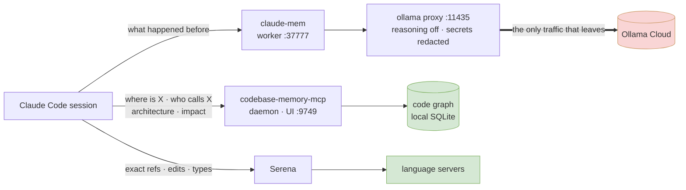

<h1 align="center">Claude Code Stack</h1>

<p align="center">
  <b>Persistent memory and real code intelligence for Claude Code — and the one rule that keeps them from competing.</b>
</p>

<p align="center">
  
  
  
  
</p>

<p align="center">
  <b>English</b> ·
  <a href="README.ru.md">Русский</a> ·
  <a href="README.zh-CN.md">中文</a> ·
  <a href="README.es.md">Español</a>
</p>

---

Four tools that give Claude Code memory surviving across sessions and a structural map of your code — plus the global `CLAUDE.md` that assigns each one its job. Installed and verified end-to-end; the [gotchas](#gotchas) are the part you actually want, since each entry cost real debugging time.

## Contents

- [The stack](#the-stack) · [How it fits together](#how-it-fits-together) · [Why two code tools](#why-two-code-tools)
- [Install](#install) · [Verify](#verify)
- [**Prompts to paste**](#prompts-to-paste) ← start here after installing
- [Gotchas](#gotchas) · [Cost and footprint](#cost-and-footprint) · [Privacy](#privacy)

## The stack

| Tool | What it gives you | Runs as |
|---|---|---|
| **[claude-mem](https://github.com/thedotmack/claude-mem)** | Cross-session **conversational** memory. Captures what happened and injects relevant past work at session start. | Local worker + SQLite + Chroma |
| **[claude-mem-ollama-proxy](https://github.com/limeflash/claude-mem-ollama-proxy)** | Routes claude-mem's memory generation to **Ollama Cloud**, disables reasoning, and **redacts secrets** before anything leaves the machine. | Local proxy on `127.0.0.1:11435` |
| **[codebase-memory-mcp](https://github.com/DeusData/codebase-memory-mcp)** | Persistent **code knowledge graph** — functions, call chains, routes, cross-repo links. Architecture answers in milliseconds. | Native binary + daemon |
| **[serena](https://github.com/oraios/serena)** | Live **LSP** symbol navigation, exact references, and symbol-level *editing*. | Language servers per project |

## How it fits together



Everything green stays on your machine. The only outbound traffic is memory generation, and it passes through the proxy that strips credentials first.

## Why two code tools

Installing a code graph *and* an LSP server without a rule makes the agent thrash: one says "read the graph", the other says "use LSP". [`CLAUDE.md`](CLAUDE.md) settles it in one line — **the graph answers questions, Serena makes changes**:

| Question | Tool |
|---|---|
| Where is this? Who calls it? How is it built? What breaks if I change it? | **graph** — instant, covers every indexed repo, works across repos |
| Exact references before touching a symbol · the edit itself · type errors after | **Serena** — reads current on-disk truth, and can modify code |

If the graph and the files disagree, **the files win** — re-index instead of trusting a stale answer.

## Install

Order matters: the proxy edits `~/.claude-mem/settings.json`, so claude-mem has to exist first.

### 1 · claude-mem

```powershell
npx claude-mem install
```

Choose the **Worker** runtime. Any OpenAI-compatible provider works — the proxy overrides it in step 2 — so the cheapest path is to paste an **Ollama** key from [ollama.com/settings/keys](https://ollama.com/settings/keys).

> The installer may end with `Fatal error: ENOENT ... .install-version` plus an npm `ERESOLVE` warning. **Both are harmless** — see [gotchas](#gotchas).

### 2 · Ollama proxy

```powershell
git clone https://github.com/limeflash/claude-mem-ollama-proxy.git
cd claude-mem-ollama-proxy
.\windows\install.ps1
```

macOS/Linux: `./macos/install.sh`. Registers an at-logon task (no admin), points claude-mem at `http://127.0.0.1:11435/v1`, defaults to `deepseek-v4-flash:0731`. Another model: `-Model "gpt-oss:120b"` — list them at `https://ollama.com/v1/models`.

It injects `reasoning_effort: "none"`. Without that a reasoning model returns its answer in `reasoning`, leaves `content` empty, and claude-mem silently stores nothing.

### 3 · codebase-memory-mcp

```powershell
Invoke-WebRequest -Uri https://raw.githubusercontent.com/DeusData/codebase-memory-mcp/main/install.ps1 -OutFile install.ps1
Unblock-File .\install.ps1
.\install.ps1
```

Native binary — **no API key, no runtime**. Semantic search uses embedded embeddings; nothing leaves the machine. It auto-configures every agent CLI it detects.

```powershell
codebase-memory-mcp daemon start
codebase-memory-mcp cli index_repository --repo-path C:\path\to\repo
codebase-memory-mcp cli list_projects
```

Index **each repo separately**. An umbrella folder full of `node_modules` and build output produces one useless blob instead of clean per-project graphs.

### 4 · Serena

```powershell
uv tool install --from git+https://github.com/oraios/serena serena-agent
claude mcp add serena -s user -- serena start-mcp-server --context claude-code --project-from-cwd --enable-web-dashboard False
```

Pin a release with `@v1.7.0` after the repo URL. To upgrade later, add `--force`; if it fails to remove the old tool directory, see [gotchas](#gotchas).

### 5 · Global instructions

Copy [`CLAUDE.md`](CLAUDE.md) to `~/.claude/CLAUDE.md`. It loads into every session automatically, so the rules apply without you saying anything.

Keep it in English even if you work in another language — it is configuration read by the agent, not documentation for you.

## Verify

```powershell
Get-ScheduledTask -TaskName claude-mem-ollama-proxy
Get-Content "$env:USERPROFILE\.claude-mem-proxy\proxy.log" -Tail 5
# healthy: POST /v1/chat/completions -> 200 [reasoning_effort=none]

Invoke-WebRequest http://localhost:37777 -UseBasicParsing | Select-Object StatusCode

codebase-memory-mcp daemon status
codebase-memory-mcp cli list_projects        # UI: http://127.0.0.1:9749
```

In Claude Code, `/mcp` should list `serena` and `codebase-memory-mcp`. **MCP servers connect only at startup — restart Claude Code after installing.**

## Prompts to paste

Copy-paste straight into a session. Language does not matter — write in whatever you normally use. More in [`PROMPT.md`](PROMPT.md).

### Orientation — first message in a new repo

```text
This machine has two code-intelligence servers. Use them instead of grepping the tree or reading whole files.
The graph (codebase-memory-mcp) answers questions. Serena makes changes.

1. Call list_projects first. If this repo is not indexed, index it with index_repository before anything else.
   If it is indexed but anything big happened outside this session — git pull, branch switch, rebase, or the
   daemon was down — re-index it as well. The watcher only keeps the graph fresh while it is actually running,
   and a stale graph fails silently.
2. For "where is X / who calls X / how is this built / what breaks if I change X" use get_architecture,
   search_graph, trace_path, query_graph, get_code_snippet. Semantic search is a mode of search_graph
   (semantic_query=["a","b"]), not a separate tool. Do not fall back to Grep/Glob for structural questions.
3. Serena holds one project at a time. If the file you are about to edit lives outside this session's working
   directory, call activate_project("<repo path>") first — otherwise the wrong language servers are running.
   Then get exact references with find_referencing_symbols, edit with replace_symbol_body /
   insert_after_symbol / rename_symbol / safe_delete_symbol, and run get_diagnostics_for_file.
4. If the graph and the files disagree, the files win — re-index rather than trust a stale answer.

Start with a short architecture summary of this repo from the graph, and tell me if anything above was unavailable.
```

That last sentence matters: without it, a missing MCP server turns into the agent quietly grepping and pretending everything is fine.

### Health check — when something feels off

```text
Check my setup and report what is actually broken, not what should be there:
- is the codebase-memory-mcp daemon active, and how many projects are indexed?
- is serena connected?
- does the claude-mem worker answer on http://localhost:37777?
- does ~/.claude-mem-proxy/proxy.log show recent "-> 200 [reasoning_effort=none]" lines?
For anything failing, give me the cause and the fix — do not just restart things.
```

### Set up a new machine

```text
Read the README in this repo and set up the whole stack on this machine, in the order given.
Stop and tell me before anything that needs a paid key. When done, run the health check and show the result.
```

### Index a batch of repos

```text
Index every git repository under <path> into the code graph. Index each repo separately — do not index a
parent folder containing several of them — and skip empty stubs, archives, and folders that are only build
output or datasets. Then show me the project list with node and edge counts.
```

## Keeping claude-mem from blocking you

claude-mem's `UserPromptSubmit` hook is **synchronous**. When the worker is unreachable it exits non-zero and Claude Code **blocks your prompt** — observed for real, 77 consecutive rejected prompts. The plugin marks its `PostToolUse`, `PreToolUse` and `Stop` hooks `"async": true`, which cannot block; the one hook standing between you and your keyboard is not.

It gets stuck because the failure is self-perpetuating: the worker dies, its listening socket on `:37777` survives (inherited by a live child process), the launcher sees the port occupied and logs `Port already in use, refusing to start duplicate`, nothing answers health checks, so every hook fails — forever.

Two layers, in [`watchdog/`](watchdog):

**1. Hook hardening — the guarantee.** [`harden-hooks.js`](watchdog/harden-hooks.js) wraps the blocking hooks in a subshell:

```bash
node watchdog/harden-hooks.js ~/.claude/plugins/cache/thedotmack/claude-mem/<version>/hooks/hooks.json
```

An `exit 1` inside the original command now terminates only the subshell, and the trailing `exit 0` still runs — so a dead worker costs you some observations instead of your ability to type. Idempotent; re-apply after a plugin update, since the plugin cache is overwritten.

**2. Watchdog — the recovery.** [`claude-mem-watchdog.ps1`](watchdog/claude-mem-watchdog.ps1) as a scheduled task, every 5 minutes: probes `:37777`, and if it is unhealthy kills the hung worker and respawns it. It also checks the Ollama proxy on `:11435` — that one runs in a console window, so a stray Ctrl+C kills it, after which the worker still reports healthy while every generation request quietly fails. It refuses to resurrect the plugin if you disabled it, never touches your Claude Code sessions, and skips the port owner unless it is genuinely a claude-mem worker — the `.claude-mem-proxy` process matches a naive `*claude-mem*` filter and must not be killed.

```powershell
$s = "$env:USERPROFILE\.claude-mem-watchdog\watchdog.ps1"
$a = New-ScheduledTaskAction -Execute powershell.exe -Argument "-NoProfile -ExecutionPolicy Bypass -WindowStyle Hidden -File `"$s`""
$t = New-ScheduledTaskTrigger -Once -At (Get-Date).AddMinutes(1) -RepetitionInterval (New-TimeSpan -Minutes 5)
Register-ScheduledTask -TaskName claude-mem-watchdog -Action $a -Trigger $t
```

**When the port owner PID is dead**, the handle was inherited by a child that outlived the worker. In practice that child is claude-mem's own Chroma stack — `chroma-mcp.exe` and its python workers — orphaned when the worker died, *not* an editor session. The watchdog kills those, then proves the port is genuinely reclaimed with a bind test before respawning; a `LISTENING` row in `netstat` is not proof either way. If something it cannot identify still holds the port, it logs that and stops rather than killing processes at random.

## Gotchas

Every one of these was hit for real.

| Symptom | Cause | Fix |
|---|---|---|
| `npx claude-mem install` ends in `Fatal error: ENOENT ... marketplaces\thedotmack\plugin\.install-version` | Cosmetic path bug — the file is written one level up | **Ignore.** Check the plugin cache has `node_modules` and the MCP responds |
| …and an npm `ERESOLVE` tree-sitter conflict | Redundant install of **dev-only** grammars; runtime deps already installed via `bun` | **Ignore** |
| Memory generation costs a fortune | Default paths bill per observation (Haiku ≈ $58/1k, OpenRouter ≈ $8/1k) | Use the proxy — generation moves to your Ollama Cloud balance |
| claude-mem stores nothing, no error shown | Reasoning model put text in `reasoning`, left `content` empty | The proxy's `reasoning_effort: "none"` |
| `codebase-memory-mcp` install exits 1 and PATH is never registered | One failing agent config aborts activation. A **Hermes** config at `%LOCALAPPDATA%\hermes\config.yaml` fails deterministically regardless of contents — [issue #1656](https://github.com/DeusData/codebase-memory-mcp/issues/1656) | Remove/rename that dir, or add the install dir to PATH by hand. Other agents configure fine |
| `daemon status` says "not running" while the UI on :9749 answers | Competing daemons, usually from repeated `install --force` | `daemon stop`, kill leftover `codebase-memory-mcp.exe`, `daemon start` once |
| Graph answers look stale | `auto_watch=true` refreshes **indexed** projects, but `auto_index=false` — new repos are never picked up | Run `index_repository` once per new repo |
| **Prompts stop working**: `A hook blocked your prompt … claude-mem worker unreachable for N consecutive hooks` | The worker died, its `:37777` socket survived, the launcher refuses to spawn a duplicate, health checks fail — and the synchronous `UserPromptSubmit` hook blocks input. Self-perpetuating | Disable the plugin to type again, then apply [`watchdog/`](watchdog). See [the section above](#keeping-claude-mem-from-blocking-you) |
| A port shows a listener whose PID does not exist (`taskkill: process not found`) | Orphaned socket — a child inherited the handle and outlived its owner. For claude-mem the culprit is its own `chroma-mcp.exe` + python workers, still running after the worker died | Kill those helpers, then confirm with an actual bind (`[System.Net.Sockets.TcpListener]`) — `netstat` still lists the ghost until the last handle closes. No reboot needed |
| Serena fails with `Cannot extract symbols from <file>. Active language servers: ['python']` on a TypeScript (or other) file | **Not missing language support.** Serena holds one project at a time and binds to the session's working directory, so only that project's language servers are up | `activate_project("<repo path>")`, then retry. Verified: activating a TS repo brings up the `typescript` server and symbol extraction works |
| Agent claims `semantic_query` / `activate_project` "do not exist" | `semantic_query` is a **parameter of `search_graph`**, not a tool — so searching the tool list for it fails. `activate_project` *does* exist; a keyword tool-search just ranks it poorly | Call `search_graph(semantic_query=["a","b"])`; select `activate_project` by exact name |
| `detect_changes` returns `seed_symbols: 0` despite many changed files | It diffs against `base_branch` (default `main`) or `since` — uncommitted working-tree changes resolve to no symbols | Commit first, pass the right `base_branch`/`since`, or fall back to `trace_path` for blast radius |
| `uv tool install --force` fails: *"failed to remove directory … reparse point … (os error 4395)"* | Misleading error — there is usually no reparse point. Stop every `serena.exe` first; if it persists, the directory needs a forced delete | `robocopy <empty-dir> <tool-dir> /MIR`, then `rmdir /s /q`, then install again |
| **Every plugin suddenly reads `Disabled` and cannot be re-enabled** | Something rewrote `~/.claude/settings.json` with a UTF-8 **BOM** — `Set-Content -Encoding UTF8` does exactly that on PowerShell 5.1. A leading `EF BB BF` makes a strict JSON parser reject the entire file, so nothing in it applies | Rewrite it BOM-less: `node -e "const f=require('fs'),p='<file>';let s=f.readFileSync(p,'utf8');if(s.charCodeAt(0)===0xFEFF)s=s.slice(1);f.writeFileSync(p,JSON.stringify(JSON.parse(s),null,2))"`. Never round-trip Claude config through `Set-Content -Encoding UTF8`; use `[System.IO.File]::WriteAllText($p,$json,(New-Object System.Text.UTF8Encoding($false)))` |
| PowerShell 5.1 script dies with *"The property cannot be found on this object"* | `$json.NewKey = value` throws on 5.1 for keys absent from a `ConvertFrom-Json` object | `Add-Member -NotePropertyName ... -Force` |
| A path variable turns into something like `MSFT_TaskSettings3` | PowerShell variables are **case-insensitive** — `$settings` silently clobbers `$Settings` | Rename one |
| Native `.exe` output appears as red `NativeCommandError` | PowerShell wraps a native program's stderr; the program did not fail | Check the exit code, not the color |

## Cost and footprint

**codebase-memory-mcp** and **Serena** are free and fully local. Only **claude-mem** bills per observation — with the proxy that draws on your Ollama Cloud balance.

| | Disk | Memory |
|---|---|---|
| codebase-memory-mcp | 282 MB binary + graph cache (~450 MB for 19 repos / 111k nodes) | one daemon |
| Serena | small | ~1.6 GB with language servers across several open sessions |
| claude-mem | SQLite + Chroma, grows with use | worker + embedding stack |

## Privacy

The graph and Serena are entirely local. claude-mem **does** send conversation content to a model — the proxy scans message bodies and replaces credentials with `[SECRET:{type}]` before forwarding, logging `[redacted: ...]` when it fires. Keep `CMP_REDACT` on.

## License

[MIT](LICENSE). The four tools it documents carry their own licenses.
