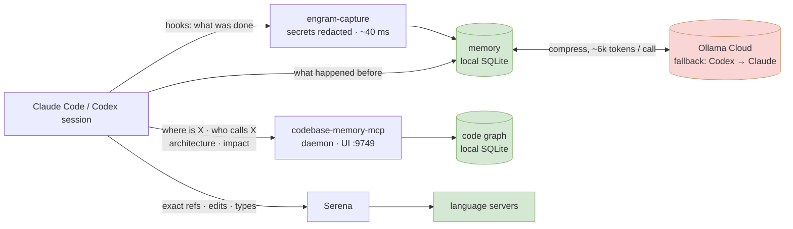

<h1 align="center">Claude Code Stack</h1>

<p align="center">
  <b>Persistent memory and real code intelligence for Claude Code — and the one rule that keeps them from competing.</b>
</p>

<p align="center">
  
  
  
  
</p>

<p align="center">
  <b>English</b> ·
  <a href="README.ru.md">Русский</a> ·
  <a href="README.zh-CN.md">中文</a> ·
  <a href="README.es.md">Español</a>
</p>

---

Three tools that give Claude Code memory surviving across sessions and a structural map of your code — plus the global `CLAUDE.md` that assigns each one its job. Installed and verified end-to-end; the [gotchas](#gotchas) are the part you actually want, since each entry cost real debugging time.

## Contents

- [The stack](#the-stack) · [How it fits together](#how-it-fits-together) · [Why two code tools](#why-two-code-tools)
- [Install](#install) · [Verify](#verify)
- [**Prompts to paste**](#prompts-to-paste) ← start here after installing
- [**Choosing the model**](#choosing-the-model) — measured, not guessed
- [**Why not claude-mem any more**](#why-not-claude-mem-any-more) — what two months of it taught
- [Gotchas](#gotchas) · [Cost and footprint](#cost-and-footprint) · [Privacy](#privacy)

## The stack

| Tool | What it gives you | Runs as |
|---|---|---|
| **[quipu](https://github.com/limeflash/quipu)** | Cross-session **memory that writes itself**. Hooks record what the agent did, a cheap cloud model compresses it into a few records, and the next session in the same repo starts with them. A fork of [engram](https://github.com/Gentleman-Programming/engram), so the agent can also search and save on its own. | One Go binary + SQLite, inside the MCP server |
| **[codebase-memory-mcp](https://github.com/DeusData/codebase-memory-mcp)** | Persistent **code knowledge graph** — functions, call chains, routes, cross-repo links. Architecture answers in milliseconds. | Native binary + daemon |
| **[serena](https://github.com/oraios/serena)** | Live **LSP** symbol navigation, exact references, and symbol-level *editing*. | Language servers per project |

## How it fits together


```mermaid
flowchart LR
    CC["Claude Code / Codex session"]

    CC -->|"hooks: what was done"| CAP["engram-capture<br/>secrets redacted · ~40 ms"]
    CAP --> MEM[("memory<br/>local SQLite")]
    MEM <-->|"compress, ~6k tokens / call"| OC[("Ollama Cloud<br/>fallback: Codex → Claude")]
    CC -->|"what happened before"| MEM

    CC -->|"where is X · who calls X<br/>architecture · impact"| CBM["codebase-memory-mcp<br/>daemon · UI :9749"]
    CBM --> GR[("code graph<br/>local SQLite")]

    CC -->|"exact refs · edits · types"| SR["Serena"]
    SR --> LS["language servers"]

    style OC fill:#f9d5d5,stroke:#c96
    style MEM fill:#d5e8d4,stroke:#82b366
    style GR fill:#d5e8d4,stroke:#82b366
    style LS fill:#d5e8d4,stroke:#82b366
```

Everything green stays on your machine. The only outbound traffic is memory compression, and credentials are stripped in the hook, before an event is even written to disk.

## Why two code tools

Installing a code graph *and* an LSP server without a rule makes the agent thrash: one says "read the graph", the other says "use LSP". [`CLAUDE.md`](CLAUDE.md) settles it in one line — **the graph answers questions, Serena makes changes**:

| Question | Tool |
|---|---|
| Where is this? Who calls it? How is it built? What breaks if I change it? | **graph** — instant, covers every indexed repo, works across repos |
| Exact references before touching a symbol · the edit itself · type errors after | **Serena** — reads current on-disk truth, and can modify code |

If the graph and the files disagree, **the files win** — re-index instead of trusting a stale answer.

Memory is a different question — *what did we do and decide before* — so it does not compete with either.

## Install

### 1 · quipu (memory)

Built from source; needs Go 1.25+.

```powershell
git clone https://github.com/limeflash/quipu.git
cd quipu
$bin = "$env:LOCALAPPDATA\Programs\engram"
go build -o "$bin\engram.exe" ./cmd/engram
go build -ldflags "-s -w" -o "$bin\engram-capture.exe" ./cmd/engram-capture
[Environment]::SetEnvironmentVariable('Path', [Environment]::GetEnvironmentVariable('Path','User') + ";$bin", 'User')   # new terminals pick it up

New-Item -ItemType Directory -Force "$HOME\.engram" | Out-Null
Set-Content "$HOME\.engram\autocapture.json" '{}'      # switches capture on
Set-Content "$HOME\.engram\ollama.key" '<your key>'    # from ollama.com/settings/keys
```

The binary keeps engram's name. Then:

- merge [`docs/fork/claude-settings.json`](https://github.com/limeflash/quipu/blob/main/docs/fork/claude-settings.json) into `~/.claude/settings.json` — capture on `PostToolUse` / `UserPromptSubmit` / `Stop`, memory on `SessionStart`;
- register the MCP server (read-only tool set — the agent reads memory without being nagged to write it):

```powershell
claude mcp add engram -s user -- "$env:LOCALAPPDATA\Programs\engram\engram.exe" mcp --tools=mem_search,mem_context,mem_get_observation,mem_timeline,mem_current_project,mem_list_projects
```

- **Codex** too: append [`docs/fork/codex-config.toml`](https://github.com/limeflash/quipu/blob/main/docs/fork/codex-config.toml) to `~/.codex/config.toml`, then approve the new hooks once in an interactive `codex`.
- **Fallbacks** when the Ollama quota runs out: Codex works if `codex` is logged in; for Claude, save the output of `claude setup-token` to `~/.engram/claude.token`.
- **Coming from claude-mem:** `engram import claude-mem --dry-run --root <your repos folder>`, then without `--dry-run`.

Everything else — configuration, commands, how records are ranked — is in the [quipu README](https://github.com/limeflash/quipu#readme).

### 2 · codebase-memory-mcp

```powershell
Invoke-WebRequest -Uri https://raw.githubusercontent.com/DeusData/codebase-memory-mcp/main/install.ps1 -OutFile install.ps1
Unblock-File .\install.ps1
.\install.ps1
```

Native binary — **no API key, no runtime**. Semantic search uses embedded embeddings; nothing leaves the machine. It auto-configures every agent CLI it detects.

```powershell
codebase-memory-mcp daemon start
codebase-memory-mcp cli index_repository --repo-path C:\path\to\repo
codebase-memory-mcp cli list_projects
```

Index **each repo separately**. An umbrella folder full of `node_modules` and build output produces one useless blob instead of clean per-project graphs.

### 3 · Serena

```powershell
uv tool install --from git+https://github.com/oraios/serena@9f9db76622340930d66aba9f72a2349b30bb1e29 serena-agent
claude mcp add serena -s user -- serena start-mcp-server --context claude-code --project-from-cwd --enable-web-dashboard False
```

**Keep the pin.** It is the last 1.x commit (2026-09-06, reports `1.7.1.dev0`). Since 2026-09-15 Serena's `main` is the unreleased `2.0.0.dev0`: there `activate_project` requires a `session_id`, which the rules in [`CLAUDE.md`](CLAUDE.md) do not pass, and the application is relicensed under GPL-3.0. Move the pin once 2.0 is released and the rules are adapted. To reinstall or upgrade, add `--force`; if it fails to remove the old tool directory, see [gotchas](#gotchas).

### 4 · Global instructions

Copy [`CLAUDE.md`](CLAUDE.md) to `~/.claude/CLAUDE.md`. It loads into every session automatically, so the rules apply without you saying anything.

Keep it in English even if you work in another language — it is configuration read by the agent, not documentation for you.

## Verify

```powershell
engram autocapture probe         # one tiny call to every model in the chain: "ok" per line
engram autocapture status        # spool should drain to 0; calls / tokens / records per day

codebase-memory-mcp daemon status
codebase-memory-mcp cli list_projects        # UI: http://127.0.0.1:9749
```

In Claude Code, `/mcp` should list `engram`, `serena` and `codebase-memory-mcp`, and a new session in an indexed repo should open with an `<engram-memory project="…">` block once there is something to remember. **MCP servers connect only at startup — restart Claude Code after installing.**

## Prompts to paste

Copy-paste straight into a session. Language does not matter — write in whatever you normally use. More in [`PROMPT.md`](PROMPT.md).

### Orientation — first message in a new repo

```text
This machine has two code-intelligence servers. Use them instead of grepping the tree or reading whole files.
The graph (codebase-memory-mcp) answers questions. Serena makes changes.

1. Call list_projects first. If this repo is not indexed, index it with index_repository before anything else.
   If it is indexed but anything big happened outside this session — git pull, branch switch, rebase, or the
   daemon was down — re-index it as well. The watcher only keeps the graph fresh while it is actually running,
   and a stale graph fails silently.
2. For "where is X / who calls X / how is this built / what breaks if I change X" use get_architecture,
   search_graph, trace_path, query_graph, get_code_snippet. Semantic search is a mode of search_graph
   (semantic_query=["a","b"]), not a separate tool. Do not fall back to Grep/Glob for structural questions.
3. Serena holds one project at a time. Started inside a repo, it stays bound to that repo for the whole session —
   activate_project is disabled by design and files in other repos are out of its reach. Started outside any
   repo, call activate_project("<repo path>") before the first lookup.
   Then get exact references with find_referencing_symbols, edit with replace_symbol_body /
   insert_after_symbol / rename_symbol / safe_delete_symbol, and run get_diagnostics_for_file.
4. If the graph and the files disagree, the files win — re-index rather than trust a stale answer.

Start with a short architecture summary of this repo from the graph, and tell me if anything above was unavailable.
```

That last sentence matters: without it, a missing MCP server turns into the agent quietly grepping and pretending everything is fine.

### Health check — when something feels off

```text
Check my setup and report what is actually broken, not what should be there:
- is the codebase-memory-mcp daemon active, and how many projects are indexed?
- are serena and engram connected?
- does `engram autocapture probe` pass, and does `engram autocapture status` show the spool draining
  and recent model calls without errors?
For anything failing, give me the cause and the fix — do not just restart things.
```

### Recall — what happened before

```text
Before we start: search memory for what was done and decided about <topic> in this project, and in other
projects if it is not here (mem_search with all_projects=true). Open the most relevant records in full and
tell me what still applies — the code wins if they disagree.
```

### Set up a new machine

```text
Read the README in this repo and set up the whole stack on this machine, in the order given.
Stop and tell me before anything that needs a paid key. When done, run the health check and show the result.
```

### Index a batch of repos

```text
Index every git repository under <path> into the code graph. Index each repo separately — do not index a
parent folder containing several of them — and skip empty stubs, archives, and folders that are only build
output or datasets. Then show me the project list with node and edge counts.
```

## Keeping the code graph alive

The `codebase-memory-mcp` daemon needs a deliberate keep-alive, and this is the trap: its daemon and CLI find each other through a named pipe whose name is a hash of the launching context.

```
started by Task Scheduler : cbm-daemon-bc0bed48…
started from a session    : cbm-daemon-2a438ffc…
```

A daemon launched from a scheduled task therefore runs fine, holds the UI port, and is **permanently invisible** — `daemon status` reports "not running" next to a live process. The CLI then spawns a throwaway daemon per command, those race, the registry wedges, and the projects list comes back empty. The project `.db` files are never affected; only the registry is.

So it is kept alive by a **Claude Code SessionStart hook** instead, which runs in the context where the pipe name matches: [`ensure-cbm-daemon.ps1`](hooks/ensure-cbm-daemon.ps1) behind the fire-and-forget wrapper [`cbm-daemon-ensure.cmd`](hooks/cbm-daemon-ensure.cmd). Copy both to `~/.claude/hooks/` and register the wrapper on every `SessionStart` matcher in `~/.claude/settings.json`:

```json
{ "type": "command", "command": "cmd.exe /d /v:off /s /c '\"\"%USERPROFILE%\\.claude\\hooks\\cbm-daemon-ensure.cmd\"\"'", "timeout": 10 }
```

The wrapper returns in ~40 ms with exit code 0 — it detaches the real work, so a slow or failing repair can never delay or block a session. And because it only runs when a session starts, the daemon exists exactly when something needs it. Only processes carrying the daemon flag are ever stopped; the unflagged ones are MCP servers owned by live sessions. It logs to `~/.claude/hooks/cbm-daemon.log`.

## Choosing the model

**Use `deepseek-v4.1-flash`** — quipu's default, with `glm-5.3-flash` behind it. It was measured, not guessed: eight real sessions from this machine with known ground truth, scored on whether the summary kept the fact that mattered.

| | **deepseek-v4.1-flash** | glm-5.3-flash | deepseek-v4-flash:0731 (retired) |
|---|---|---|---|
| Facts kept | **10/10** | 10/10 | 7/10 |
| Tokens per call | **~62** | ~480 | ~44 |
| Latency | **0.6 s** | 5.2 s | 0.9 s |
| Session quota per call | **< 0.007%** | ~0.020% | — |

The retired `0731` lost the number `266` from "273 attempts, 266 failures, 5 successes" and then contradicted itself, and on the session that took two hours to understand it omitted that the shutdown was **by design** — the whole finding. `glm-5.3-flash` fixed that; `deepseek-v4.1-flash` keeps the same facts at an eighth of the tokens and latency and at most a third of the quota, and read by hand it is if anything tidier — GLM invented "on locked dirs" in one summary.

### Thinking models need the native endpoint

Ollama's OpenAI-compatible `/v1/chat/completions` does not accept the `think` parameter ([ollama#15288](https://github.com/ollama/ollama/issues/15288), [#15293](https://github.com/ollama/ollama/issues/15293)), so a thinking model either narrates into `content` — 1300–1600 characters of *"The user wants me to compress…"* — or returns `content` empty. quipu talks to the native `/api/chat` only, with `think: false` — except for model prefixes listed in `ollama.think` (default `glm-`), which get `think: true`: that puts deliberation in its own `thinking` field and leaves `content` for the answer, where `false` merely inlines the narration back. Ollama also ignores the JSON schema in `format`, so the reply is validated locally and gets one repair round.

### What it actually costs — and how this repo got it wrong

Ollama Cloud is a subscription: token counts are not money. What runs out is **quota** — a 5-hour session limit and a weekly limit, weighted per model rather than per token, shared by every model on the account.

An earlier version of this section read 0.5% weekly usage and promised "~1% on GLM, roughly 100× headroom". **That was wrong.** The reading was taken right after the weekly window reset — the counter showed only 271 requests — and extrapolated from there. Running GLM all week produced 4,386 GLM requests and 1,990 others, and the weekly quota hit **100%**:

```
          200     429 (quota)   410 (model retired)
09-19     863        6,876            0
09-24     207       26,109            0
09-25       1       21,142        6,427
```

Because quota is account-wide, every model answered 429 at once, the fallback model could not help, and claude-mem kept retrying — up to 26,000 refused calls a day — while memory went unwritten for most of a week. That is why quipu never retries a refused model in a loop: a 429 blocks that model for 15 minutes, doubling up to 2 hours, and the batch moves down the chain. The second Ollama model usually refuses too — the quota is account-wide — so the work lands on **Codex** (`gpt-6-luna`, your ChatGPT plan) and then **Claude** (`claude-sonnet-5-5`, your Claude plan), each capped at 20 calls an hour. A 410 — the provider retired the model — disables that model for good. `engram autocapture status` shows where each model stands.

## Why not claude-mem any more

Until October 2026 this stack ran [claude-mem](https://github.com/thedotmack/claude-mem) behind a [proxy](https://github.com/limeflash/claude-mem-ollama-proxy) (now archived) that moved generation to Ollama Cloud and stripped secrets, plus a watchdog that kept its worker alive. It worked — the proxy alone stripped **4,192 credentials** in two weeks that would otherwise have been sent verbatim to a third-party model — but every piece of that list existed to patch something:

- its synchronous `UserPromptSubmit` hook **blocked prompts** when the worker died — 77 rejected in a row once;
- the dead worker's socket was inherited by orphaned Chroma processes, so the worker could not restart, and the watchdog had to learn to tell that apart from a normal idle shutdown — it got it wrong **273 times** in two weeks, flashing a console window every five minutes;
- the database grew to gigabytes from a cloud-sync outbox nobody used;
- each generation call sent **~150k input tokens** of accumulated history; on 5 October that came to **2.7 billion** tokens in a day.

quipu replaces all of it with hooks that write a file and exit, compression inside the MCP server that already runs, and stateless calls. Measured on the same four sessions on 7 October — claude-mem until it was switched off, quipu after:

| | claude-mem | quipu |
|---|---|---|
| records per hour of work | 270–330 | 36–66 |
| notes that only retell code that was read | 65% | 29% |
| input tokens that day | 343.6 M (avg 152k / call) | 0.72 M (avg 6.4k / call) |
| blind audit of 60 random records: useful / noise / duplicate | 14 / 45 / 1 | 45 / 11 / 4 |

claude-mem still produced more useful records per hour in absolute terms (~70 against ~37) — buried under three noise records each. The whole claude-mem history (49k records, 1.5k summaries, 3.1k prompts) was imported with `engram import claude-mem`, so nothing was lost in the switch.

## Gotchas

Every one of these was hit for real.

| Symptom | Cause | Fix |
|---|---|---|
| New quipu hooks do nothing in **Codex** | Codex runs a new or changed hook only after you trust it once | Start an interactive `codex` and approve the hooks |
| Codex `exec` writes events but never a turn summary | `codex exec` exits before an `async` Stop hook finishes | Keep `Stop` synchronous — the shipped config does |
| A Codex hook command with quotes or spaces fails | Codex runs hook commands through `cmd.exe` by default | Use a plain path without quotes, as in the shipped config |
| Rebuilding `engram.exe` fails with "access denied" | Every Claude Code and Codex session holds the binary open through its MCP server; Windows refuses to overwrite a running `.exe` | Rename the old one, then copy the new one in — renaming a running image is allowed. Delete the `*.old-*.exe` once sessions restart |
| The Claude fallback answers `401` | Inside a Claude Code session the child `claude -p` inherits `ANTHROPIC_*` / `CLAUDE*` variables pointing at the parent's credentials | quipu scrubs them and uses only `~/.engram/claude.token` from `claude setup-token` |
| A PostToolUse hook adds visible lag on Windows | Process start scales with image size: ~110 ms for a 30 MB binary, 19 ms for a 2 MB one | That is why capture is a separate 3 MB `engram-capture`; keep hooks `async` |
| `codebase-memory-mcp` install exits 1 and PATH is never registered | One failing agent config aborts activation. A **Hermes** config at `%LOCALAPPDATA%\hermes\config.yaml` fails deterministically regardless of contents — [issue #1656](https://github.com/DeusData/codebase-memory-mcp/issues/1656) | Remove/rename that dir, or add the install dir to PATH by hand. Other agents configure fine |
| `daemon status` says "not running" while the UI on :9749 answers | Competing daemons, usually from repeated `install --force` | `daemon stop`, kill leftover `codebase-memory-mcp.exe`, `daemon start` once |
| **The graph UI lists no projects**, or `daemon status` says "not running" while a `codebase-memory-mcp.exe` is clearly alive and serving `:9749` | The daemon was started from a context whose pipe-name hash differs from the CLI's — Task Scheduler is the usual culprit. It runs and is never found, so every CLI call spawns a throwaway daemon and those race until the registry wedges | Your data is fine — the per-project `.db` files are untouched. Kill every process flagged `--cbm-daemon-internal` (never the unflagged ones, those are session-owned MCP servers), then `daemon start` **from a terminal inside a session**. Automate it with the [SessionStart hook](#keeping-the-code-graph-alive) |
| Graph answers look stale | `auto_watch=true` refreshes **indexed** projects, but `auto_index=false` — new repos are never picked up | Run `index_repository` once per new repo |
| `codebase-memory-mcp cli …` hangs forever at 0% CPU when an agent runs it | The CLI also reads its JSON arguments from stdin (`echo '<json>' \| codebase-memory-mcp cli <tool>`) and waits for EOF whenever stdin is not a terminal — an agent's shell tool never sends one. Measured: 4 s with stdin closed, 16 s with it held open for 15 s | Close stdin: `codebase-memory-mcp cli list_projects < /dev/null`. Seen from Claude Code on macOS |
| After upgrading `codebase-memory-mcp` to 0.11 and re-indexing, every repo is listed twice | 0.11 names projects by their full path (the root with `/` turned into `-`, e.g. `Users-<you>-Projects-<repo>`) instead of the folder name, so re-indexing creates a new project beside the old one — whose stale graph stays searchable | `delete_project --project <old-name>` for each short-named duplicate. They hold only derived graph data; copy out any ADRs you saved with `manage_adr` first. To upgrade at all, re-run step 2's installer: `update` only points at a local copy of it that pre-0.11 installs never placed |
| A port shows a listener whose PID does not exist (`taskkill: process not found`) | Orphaned socket — a child inherited the handle and outlived its owner | Kill the surviving children, then confirm with an actual bind (`[System.Net.Sockets.TcpListener]`) — `netstat` still lists the ghost until the last handle closes. No reboot needed |
| Serena fails with `Cannot extract symbols from <file>. Active language servers: ['python']` on a TypeScript (or other) file | **Not missing language support.** Serena holds one project at a time and binds to the session's working directory, so only that project's language servers are up | Session started outside any repo: `activate_project("<repo path>")`, then retry — verified, activating a TS repo brings up the `typescript` server and symbol extraction works. Started inside a repo: this session can have no other project (next row) — open a session in the other repo |
| Agent claims `semantic_query` / `activate_project` "do not exist" | `semantic_query` is a **parameter of `search_graph`**, not a tool — so searching the tool list for it fails. `activate_project` exists only in a session started **outside** any repo, where a keyword tool-search just ranks it poorly. Started inside one, the `claude-code` context is single-project (`single_project: true`) and removes it by design — 21 tools instead of 23 | Call `search_graph(semantic_query=["a","b"])`; select `activate_project` by exact name. If it is really absent, the session is bound to its repo — work on another repo from a session started there |
| `detect_changes` returns `seed_symbols: 0` despite many changed files | It diffs against `base_branch` (default `main`) or `since` — uncommitted working-tree changes resolve to no symbols | Commit first, pass the right `base_branch`/`since`, or fall back to `trace_path` for blast radius |
| `uv tool install --force` fails: *"failed to remove directory … reparse point … (os error 4395)"* | Misleading error — there is usually no reparse point. Stop every `serena.exe` first; if it persists, the directory needs a forced delete | `robocopy <empty-dir> <tool-dir> /MIR`, then `rmdir /s /q`, then install again |
| After a reinstall, `serena --version` reports `2.0.0.dev0` and `activate_project` demands a `session_id` | An unpinned install takes Serena's `main`, which since 2026-09-15 is the unreleased 2.0 line: `activate_project` needs a `session_id` from `initial_instructions`, which the `activate_project("<path>")` form in [`CLAUDE.md`](CLAUDE.md) does not pass, and the application is relicensed under GPL-3.0 | Reinstall with step 3's pinned command plus `--force` |
| **Every plugin suddenly reads `Disabled` and cannot be re-enabled** | Something rewrote `~/.claude/settings.json` with a UTF-8 **BOM** — `Set-Content -Encoding UTF8` does exactly that on PowerShell 5.1. A leading `EF BB BF` makes a strict JSON parser reject the entire file, so nothing in it applies | Rewrite it BOM-less: `node -e "const f=require('fs'),p='<file>';let s=f.readFileSync(p,'utf8');if(s.charCodeAt(0)===0xFEFF)s=s.slice(1);f.writeFileSync(p,JSON.stringify(JSON.parse(s),null,2))"`. Never round-trip Claude config through `Set-Content -Encoding UTF8`; use `[System.IO.File]::WriteAllText($p,$json,(New-Object System.Text.UTF8Encoding($false)))` |
| PowerShell 5.1 script dies with *"The property cannot be found on this object"* | `$json.NewKey = value` throws on 5.1 for keys absent from a `ConvertFrom-Json` object | `Add-Member -NotePropertyName ... -Force` |
| A path variable turns into something like `MSFT_TaskSettings3` | PowerShell variables are **case-insensitive** — `$settings` silently clobbers `$Settings` | Rename one |
| Native `.exe` output appears as red `NativeCommandError` | PowerShell wraps a native program's stderr; the program did not fail | Check the exit code, not the color |

## Cost and footprint

**codebase-memory-mcp** and **Serena** are free and fully local. **quipu** spends Ollama Cloud quota — ~6.4k input tokens per compression call; 112 calls covered two hours of four parallel sessions — and, only when that runs out, your Codex or Claude plan, capped at 20 calls an hour each.

| | Disk | Memory |
|---|---|---|
| quipu | ~30 MB + 3 MB binaries; the database grows with use (~500 MB here, most of it 49k records imported from claude-mem) | none of its own — runs inside each session's `engram mcp` |
| codebase-memory-mcp | 282 MB binary + graph cache (~450 MB for 19 repos / 111k nodes) | one daemon |
| Serena | small | ~1.6 GB with language servers across several open sessions |

## Privacy

The graph and Serena are entirely local. quipu **does** send what the agent did to a model for compression — but redaction runs in the capture hook, before the event is written to disk: API keys, tokens, JWTs, URL credentials, `.env` / YAML / JSON secrets, `Authorization` headers, PEM blocks and seed phrases become `[SECRET:{type}]`, and files that were only read are never sent with their contents. The memory itself stays in `~/.engram/engram.db`.

## License

[MIT](LICENSE). The three tools it documents carry their own licenses.
