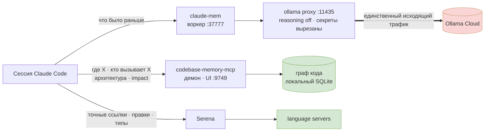

<h1 align="center">Claude Code Stack</h1>

<p align="center">
  <b>Память между сессиями и настоящее понимание кода для Claude Code — и одно правило, которое не даёт им конфликтовать.</b>
</p>

<p align="center">
  
  
  
  
</p>

<p align="center">
  <a href="README.md">English</a> ·
  <b>Русский</b> ·
  <a href="README.zh-CN.md">中文</a> ·
  <a href="README.es.md">Español</a>
</p>

---

Четыре инструмента, которые дают Claude Code память, переживающую сессию, и структурную карту твоего кода — плюс глобальный `CLAUDE.md`, который распределяет между ними роли. Всё установлено и проверено вживую; самое ценное здесь — [грабли](#грабли), каждая из них стоила реального времени на отладку.

## Содержание

- [Стек](#стек) · [Как это связано](#как-это-связано) · [Зачем два инструмента по коду](#зачем-два-инструмента-по-коду)
- [Установка](#установка) · [Проверка](#проверка)
- [**Промпты для вставки**](#промпты-для-вставки) ← начни отсюда после установки
- [Грабли](#грабли) · [Стоимость и ресурсы](#стоимость-и-ресурсы) · [Приватность](#приватность)

## Стек

| Инструмент | Что даёт | Как работает |
|---|---|---|
| **[claude-mem](https://github.com/thedotmack/claude-mem)** | **Разговорная** память между сессиями. Фиксирует происходившее и подставляет relevantный прошлый опыт при старте сессии. | Локальный воркер + SQLite + Chroma |
| **[claude-mem-ollama-proxy](https://github.com/limeflash/claude-mem-ollama-proxy)** | Направляет генерацию памяти claude-mem в **Ollama Cloud**, отключает reasoning и **вырезает секреты** до того, как что-либо покинет машину. | Локальный прокси на `127.0.0.1:11435` |
| **[codebase-memory-mcp](https://github.com/DeusData/codebase-memory-mcp)** | Постоянный **граф знаний о коде** — функции, цепочки вызовов, роуты, связи между репозиториями. Ответы по архитектуре за миллисекунды. | Нативный бинарь + демон |
| **[serena](https://github.com/oraios/serena)** | Живая **LSP**-навигация по символам, точные ссылки и *правка* на уровне символов. | Language server'ы по проектам |

## Как это связано



Всё зелёное остаётся на твоей машине. Наружу уходит только генерация памяти, и она проходит через прокси, который сначала вырезает учётные данные.

## Зачем два инструмента по коду

Если поставить граф кода *и* LSP-сервер без правила, агент начинает метаться: одна система говорит «читай граф», другая — «используй LSP». [`CLAUDE.md`](CLAUDE.md) решает это одной строкой — **граф отвечает на вопросы, Serena вносит изменения**:

| Вопрос | Инструмент |
|---|---|
| Где это? Кто вызывает? Как устроено? Что сломается, если поменять? | **граф** — мгновенно, охватывает все проиндексированные репозитории, работает между ними |
| Точные ссылки перед правкой символа · сама правка · ошибки типов после | **Serena** — читает актуальное состояние файлов и умеет менять код |

Если граф и файлы расходятся — **правда за файлами**: переиндексируй, а не доверяй устаревшему ответу.

## Установка

Порядок важен: прокси правит `~/.claude-mem/settings.json`, поэтому claude-mem должен существовать раньше.

### 1 · claude-mem

```powershell
npx claude-mem install
```

Выбери рантайм **Worker**. Подойдёт любой OpenAI-совместимый провайдер — на шаге 2 прокси всё равно его переопределит, поэтому самый дешёвый путь: вставить ключ **Ollama** с [ollama.com/settings/keys](https://ollama.com/settings/keys).

> Установщик может завершиться `Fatal error: ENOENT ... .install-version` и предупреждением npm `ERESOLVE`. **И то и другое безвредно** — см. [грабли](#грабли).

### 2 · Ollama-прокси

```powershell
git clone https://github.com/limeflash/claude-mem-ollama-proxy.git
cd claude-mem-ollama-proxy
.\windows\install.ps1
```

macOS/Linux: `./macos/install.sh`. Регистрирует задачу на вход в систему (без прав администратора), направляет claude-mem на `http://127.0.0.1:11435/v1`, модель по умолчанию `deepseek-v4-flash:0731`. Другая модель: `-Model "gpt-oss:120b"` — список на `https://ollama.com/v1/models`.

Прокси подставляет `reasoning_effort: "none"`. Без этого reasoning-модель кладёт ответ в `reasoning`, оставляет `content` пустым, и claude-mem молча не сохраняет ничего.

### 3 · codebase-memory-mcp

```powershell
Invoke-WebRequest -Uri https://raw.githubusercontent.com/DeusData/codebase-memory-mcp/main/install.ps1 -OutFile install.ps1
Unblock-File .\install.ps1
.\install.ps1
```

Нативный бинарь — **без API-ключей и без рантайма**. Семантический поиск работает на встроенных эмбеддингах, ничего не уходит с машины. Сам настраивает все найденные agent-CLI.

```powershell
codebase-memory-mcp daemon start
codebase-memory-mcp cli index_repository --repo-path C:\path\to\repo
codebase-memory-mcp cli list_projects
```

Индексируй **каждый репозиторий отдельно**. Зонтичная папка, набитая `node_modules` и результатами сборки, даёт один бесполезный ком вместо чистых графов по проектам.

### 4 · Serena

```powershell
uv tool install --from git+https://github.com/oraios/serena serena-agent
claude mcp add serena -s user -- serena start-mcp-server --context claude-code --project-from-cwd --enable-web-dashboard False
```

Зафиксировать релиз можно, дописав `@v1.7.0` после URL. Для обновления добавь `--force`; если не удаётся удалить старый каталог инструмента — см. [грабли](#грабли).

### 5 · Глобальные инструкции

Скопируй [`CLAUDE.md`](CLAUDE.md) в `~/.claude/CLAUDE.md`. Он подгружается в каждую сессию автоматически, так что правила действуют без единого слова с твоей стороны.

Держи его **на английском**, даже если работаешь на другом языке: это конфигурация, которую читает агент, а не документация для тебя.

## Проверка

```powershell
Get-ScheduledTask -TaskName claude-mem-ollama-proxy
Get-Content "$env:USERPROFILE\.claude-mem-proxy\proxy.log" -Tail 5
# здоровая строка: POST /v1/chat/completions -> 200 [reasoning_effort=none]

Invoke-WebRequest http://localhost:37777 -UseBasicParsing | Select-Object StatusCode

codebase-memory-mcp daemon status
codebase-memory-mcp cli list_projects        # UI: http://127.0.0.1:9749
```

В Claude Code команда `/mcp` должна показывать `serena` и `codebase-memory-mcp`. **MCP-серверы подключаются только при старте — после установки перезапусти Claude Code.**

## Промпты для вставки

Копируй прямо в сессию. Язык не важен — пиши как привык. Больше вариантов в [`PROMPT.md`](PROMPT.md).

### Ориентация — первое сообщение в новом репозитории

```text
На этой машине есть два сервера интеллекта по коду. Используй их вместо grep по дереву и чтения файлов целиком.
Граф (codebase-memory-mcp) отвечает на вопросы. Serena вносит изменения.

1. Сначала вызови list_projects. Если этот репозиторий не проиндексирован — проиндексируй его через
   index_repository прежде чего-либо ещё. Если он проиндексирован, но снаружи этой сессии произошло что-то
   крупное — git pull, смена ветки, ребейз или демон был выключен — переиндексируй тоже. Вотчер держит граф
   свежим, только пока он реально работает, а устаревший граф врёт молча.
2. Для «где X / кто вызывает X / как это устроено / что сломается, если поменять X» используй get_architecture,
   search_graph, trace_path, query_graph, get_code_snippet. Семантический поиск — это режим search_graph
   (semantic_query=["a","b"]), а не отдельный инструмент. Не скатывайся в Grep/Glob на структурных вопросах.
3. Serena держит один проект за раз. Если файл, который собираешься править, лежит вне рабочей директории
   этой сессии — сначала вызови activate_project("<путь к репозиторию>"), иначе подняты не те language server'ы.
   Затем возьми точные ссылки через find_referencing_symbols, правь через replace_symbol_body /
   insert_after_symbol / rename_symbol / safe_delete_symbol и выполни get_diagnostics_for_file.
4. Если граф и файлы расходятся — правда за файлами: переиндексируй, а не доверяй устаревшему ответу.

Начни с краткой сводки по архитектуре этого репозитория из графа и скажи, если что-то из перечисленного
оказалось недоступно.
```

Последняя фраза важна: без неё отсутствующий MCP-сервер превращается в тихий grep, а агент делает вид, что всё нормально.

### Проверка здоровья — когда что-то идёт не так

```text
Проверь мою установку и скажи, что реально сломано, а не что должно быть:
- активен ли демон codebase-memory-mcp и сколько проектов проиндексировано?
- подключена ли serena?
- отвечает ли воркер claude-mem на http://localhost:37777?
- есть ли в ~/.claude-mem-proxy/proxy.log свежие строки "-> 200 [reasoning_effort=none]"?
По каждому сбою назови причину и способ починки — не просто перезапускай.
```

### Развернуть на новой машине

```text
Прочитай README в этом репозитории и разверни весь стек на этой машине в указанном порядке.
Остановись и спроси перед всем, что требует платного ключа. По завершении выполни проверку здоровья
и покажи результат.
```

### Проиндексировать пачку репозиториев

```text
Проиндексируй в граф кода все git-репозитории внутри <путь>. Индексируй каждый отдельно — не индексируй
родительскую папку, содержащую несколько, — и пропусти пустые заготовки, архивы и папки, где только
результаты сборки или датасеты. Затем покажи список проектов с числом узлов и рёбер.
```

## Чтобы claude-mem не блокировал тебе ввод

Хук `UserPromptSubmit` у claude-mem **синхронный**. Когда воркер недоступен, он возвращает ненулевой код, и Claude Code **блокирует твой промпт** — наблюдалось вживую, 77 отклонённых промптов подряд. Свои `PostToolUse`, `PreToolUse` и `Stop` плагин помечает `"async": true` — они заблокировать не могут; а единственный хук, стоящий между тобой и клавиатурой, — нет.

Застревает это намертво, потому что отказ самоподдерживающийся: воркер умирает, его слушающий сокет на `:37777` переживает владельца (его наследует живой дочерний процесс), лаунчер видит порт занятым и пишет `Port already in use, refusing to start duplicate`, проверки здоровья не проходят — и так каждый хук, бесконечно.

Два уровня, оба в [`watchdog/`](watchdog):

**1. Упрочнение хуков — гарантия.** [`harden-hooks.js`](watchdog/harden-hooks.js) оборачивает блокирующие хуки в подоболочку:

```bash
node watchdog/harden-hooks.js ~/.claude/plugins/cache/thedotmack/claude-mem/<версия>/hooks/hooks.json
```

Теперь `exit 1` внутри исходной команды завершает только подоболочку, а замыкающий `exit 0` всё равно выполняется — и мёртвый воркер стоит тебе нескольких пропущенных наблюдений, а не возможности печатать. Идемпотентно; повторить после обновления плагина, так как кэш перезаписывается.

**2. Сторож — восстановление.** [`claude-mem-watchdog.ps1`](watchdog/claude-mem-watchdog.ps1) как задача планировщика, раз в 5 минут: проверяет `:37777` и, если нездоров, убивает зависший воркер и поднимает заново. Заодно проверяет Ollama-прокси на `:11435` — тот крутится в консольном окне, и случайный Ctrl+C его убивает, после чего воркер продолжает рапортовать «здоров», а каждый запрос генерации молча проваливается.

Он немедленно выходит, если не запущен ни один агент, и ещё раз — если плагин выключен: нет клиента — нет потребителя, а выключенный плагин это решение, а не поломка. Держит глобальный мьютекс, чтобы ручной и плановый запуск не пересеклись: два экземпляра однажды подрались, и один убил здоровый демон, который только что поднял другой.

## Как держать граф кода живым

Демону `codebase-memory-mcp` нужен **другой механизм**, и вот в чём ловушка: демон и CLI находят друг друга через именованный pipe, имя которого — хеш от контекста запуска.

```
запущен планировщиком : cbm-daemon-bc0bed48…
запущен из сессии     : cbm-daemon-2a438ffc…
```

Поэтому демон, запущенный задачей планировщика, прекрасно работает, держит порт UI и при этом **навсегда невидим** — `daemon status` пишет «not running» рядом с живым процессом. CLI начинает поднимать одноразовый демон на каждую команду, они дерутся, реестр заклинивает, и список проектов оказывается пустым. Файлы `.db` при этом не страдают никогда — ломается только реестр.

Поэтому его держит **хук Claude Code на SessionStart**, который выполняется в контексте с совпадающим именем pipe'а: [`ensure-cbm-daemon.ps1`](watchdog/ensure-cbm-daemon.ps1) за обёрткой [`cbm-daemon-ensure.cmd`](watchdog/cbm-daemon-ensure.cmd). Скопируй оба в `~/.claude/hooks/` и пропиши обёртку на все матчеры `SessionStart` в `~/.claude/settings.json`:

```json
{ "type": "command", "command": "cmd.exe /d /v:off /s /c '\"\"%USERPROFILE%\\.claude\\hooks\\cbm-daemon-ensure.cmd\"\"'", "timeout": 10 }
```

Обёртка возвращается за ~40 мс с кодом 0 — настоящую работу она отвязывает, так что медленный или неудачный ремонт не задержит и не заблокирует сессию. А раз запускается только при старте сессии, демон существует ровно тогда, когда кому-то нужен. Он не воскрешает плагин, если ты его выключил, не трогает твои сессии Claude Code и не трогает владельца порта, если это не настоящий воркер claude-mem — процесс `.claude-mem-proxy` попадает под наивный фильтр `*claude-mem*`, и убивать его нельзя.

```powershell
$s = "$env:USERPROFILE\.claude-mem-watchdog\watchdog.ps1"
$a = New-ScheduledTaskAction -Execute powershell.exe -Argument "-NoProfile -ExecutionPolicy Bypass -WindowStyle Hidden -File `"$s`""
$t = New-ScheduledTaskTrigger -Once -At (Get-Date).AddMinutes(1) -RepetitionInterval (New-TimeSpan -Minutes 5)
Register-ScheduledTask -TaskName claude-mem-watchdog -Action $a -Trigger $t
```

**Когда владелец порта — мёртвый PID**, дескриптор унаследовал дочерний процесс, переживший воркер. На практике это собственный Chroma-стек claude-mem — `chroma-mcp.exe` и его python-воркеры, осиротевшие после смерти воркера, а **не** сессия редактора. Сторож убивает именно их, а затем доказывает освобождение порта настоящим bind-тестом — строка `LISTENING` в `netstat` доказательством не является ни в ту, ни в другую сторону. Если порт всё ещё держит что-то неопознанное, он пишет это в лог и останавливается, а не убивает процессы наугад.

## Грабли

Каждая из них случилась вживую.

| Симптом | Причина | Что делать |
|---|---|---|
| `npx claude-mem install` падает в конце с `Fatal error: ENOENT ... marketplaces\thedotmack\plugin\.install-version` | Косметический баг путей — файл пишется уровнем выше | **Игнорировать.** Проверь, что в кэше плагина есть `node_modules` и MCP отвечает |
| …и конфликт npm `ERESOLVE` по tree-sitter | Повторная установка **dev**-зависимостей; рантайм уже поставлен через `bun` | **Игнорировать** |
| Генерация памяти стоит дорого | Пути по умолчанию тарифицируются за наблюдение (Haiku ≈ $58/1k, OpenRouter ≈ $8/1k) | Поставить прокси — генерация уйдёт на баланс Ollama Cloud |
| claude-mem ничего не сохраняет, ошибок нет | Reasoning-модель положила текст в `reasoning`, `content` остался пустым | Тот самый `reasoning_effort: "none"` в прокси |
| Установка `codebase-memory-mcp` завершается с кодом 1, PATH не прописывается | Сбой конфига одного агента прерывает всю активацию. Конфиг **Hermes** в `%LOCALAPPDATA%\hermes\config.yaml` падает детерминированно вне зависимости от содержимого — [issue #1656](https://github.com/DeusData/codebase-memory-mcp/issues/1656) | Удалить/переименовать эту папку либо прописать PATH вручную. Остальные агенты настраиваются нормально |
| `daemon status` говорит «not running», а UI на :9749 отвечает | Конкурирующие демоны, обычно после повторных `install --force` | `daemon stop`, добить оставшиеся `codebase-memory-mcp.exe`, затем один `daemon start` |
| **UI графа показывает пустой список проектов**, либо `daemon status` пишет «not running», хотя `codebase-memory-mcp.exe` жив и отдаёт `:9749` | Демон запущен из контекста, чей хеш имени pipe'а не совпадает с CLI-шным — обычно это планировщик задач. Он работает и никогда не находится, поэтому каждая CLI-команда поднимает одноразовый демон, а они дерутся, пока реестр не заклинит | Данные целы — файлы `.db` по проектам не тронуты. Убить все процессы с флагом `--cbm-daemon-internal` (и только их: безфлаговые — это MCP-серверы живых сессий), затем `daemon start` **из терминала внутри сессии**. Автоматизировать [хуком на SessionStart](#как-держать-граф-кода-живым) |
| Ответы графа выглядят устаревшими | `auto_watch=true` обновляет **проиндексированные** проекты, но `auto_index=false` — новые репозитории не подхватываются | Разовый `index_repository` на каждый новый репозиторий |
| **Промпты перестают отправляться**: `A hook blocked your prompt … claude-mem worker unreachable for N consecutive hooks` | Воркер умер, его сокет на `:37777` выжил, лаунчер отказывается поднимать дубликат, проверки здоровья не проходят — и синхронный хук `UserPromptSubmit` блокирует ввод. Самоподдерживающийся дедлок | Выключить плагин, чтобы снова печатать, затем применить [`watchdog/`](watchdog). См. [раздел выше](#чтобы-claude-mem-не-блокировал-тебе-ввод) |
| Порт слушает PID, которого не существует (`taskkill: process not found`) | Осиротевший сокет — дескриптор унаследовал дочерний процесс и пережил владельца. Для claude-mem виновник — его же `chroma-mcp.exe` и python-воркеры, оставшиеся жить после смерти воркера | Убить эти вспомогательные процессы и проверить настоящим bind'ом (`[System.Net.Sockets.TcpListener]`) — `netstat` показывает призрак, пока не закрыт последний дескриптор. Перезагрузка не нужна |
| Serena падает с `Cannot extract symbols from <файл>. Active language servers: ['python']` на TypeScript-файле (или любом другом) | **Это не отсутствие поддержки языка.** Serena держит один проект за раз и привязывается к рабочей директории сессии, поэтому подняты language server'ы только этого проекта | `activate_project("<путь к репозиторию>")` и повторить. Проверено: после активации TS-репозитория поднимается `typescript`, символы извлекаются |
| Агент утверждает, что `semantic_query` / `activate_project` «не существуют» | `semantic_query` — **параметр `search_graph`**, а не инструмент, поэтому поиск по списку инструментов его не находит. `activate_project` существует, просто поиск по ключевым словам ставит его низко | Вызывать `search_graph(semantic_query=["a","b"])`; `activate_project` выбирать по точному имени |
| `detect_changes` возвращает `seed_symbols: 0` при куче изменённых файлов | Он сравнивает с `base_branch` (по умолчанию `main`) или `since` — незакоммиченные изменения рабочего дерева не разрешаются в символы | Сначала закоммитить, либо передать нужный `base_branch`/`since`, либо считать радиус через `trace_path` |
| `uv tool install --force` падает: *«failed to remove directory … reparse point … (os error 4395)»* | Ошибка вводит в заблуждение — reparse point'а обычно нет. Сначала останови все `serena.exe`; если не помогло, каталог нужно удалять принудительно | `robocopy <пустая-папка> <каталог-инструмента> /MIR`, затем `rmdir /s /q`, затем установка заново |
| **Все плагины внезапно `Disabled` и включить их нельзя** | Кто-то перезаписал `~/.claude/settings.json` с UTF-8 **BOM** — именно так делает `Set-Content -Encoding UTF8` на PowerShell 5.1. Ведущие байты `EF BB BF` заставляют строгий JSON-парсер отбросить **весь** файл, и ни одна настройка из него не применяется | Перезаписать без BOM: `node -e "const f=require('fs'),p='<файл>';let s=f.readFileSync(p,'utf8');if(s.charCodeAt(0)===0xFEFF)s=s.slice(1);f.writeFileSync(p,JSON.stringify(JSON.parse(s),null,2))"`. Никогда не гонять конфиги Claude через `Set-Content -Encoding UTF8`; писать через `[System.IO.File]::WriteAllText($p,$json,(New-Object System.Text.UTF8Encoding($false)))` |
| Скрипт на PowerShell 5.1 падает с *«The property cannot be found on this object»* | `$json.NewKey = value` на 5.1 бросает исключение для ключей, которых нет в объекте `ConvertFrom-Json` | `Add-Member -NotePropertyName ... -Force` |
| Переменная с путём превращается во что-то вроде `MSFT_TaskSettings3` | Имена переменных в PowerShell **регистронезависимы** — `$settings` молча затирает `$Settings` | Переименовать одну из них |
| Вывод нативного `.exe` показывается красным как `NativeCommandError` | PowerShell так оборачивает stderr нативной программы; программа не падала | Смотри код возврата, а не цвет |

## Стоимость и ресурсы

**codebase-memory-mcp** и **Serena** бесплатны и полностью локальны. Платит только **claude-mem** — за наблюдение, и с прокси это идёт с баланса Ollama Cloud.

| | Диск | Память |
|---|---|---|
| codebase-memory-mcp | бинарь 282 МБ + кэш графа (~450 МБ на 19 репозиториев / 111 тыс. узлов) | один демон |
| Serena | немного | ~1.6 ГБ с language server'ами при нескольких открытых сессиях |
| claude-mem | SQLite + Chroma, растёт по мере работы | воркер + стек эмбеддингов |

## Приватность

Граф и Serena полностью локальны. claude-mem **действительно** отправляет содержимое разговора в модель — прокси просматривает тела сообщений и заменяет учётные данные на `[SECRET:{type}]` до отправки, отмечая в логе `[redacted: ...]`. Не выключай `CMP_REDACT`.

## Лицензия

[MIT](LICENSE). У четырёх описанных инструментов свои лицензии.
