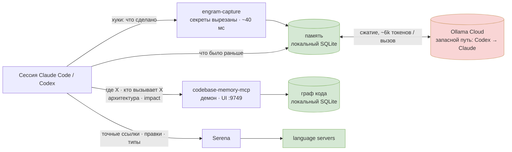

<h1 align="center">Claude Code Stack</h1>

<p align="center">
  <b>Память между сессиями и настоящее понимание кода для Claude Code — и одно правило, которое не даёт им конфликтовать.</b>
</p>

<p align="center">
  
  
  
  
</p>

<p align="center">
  <a href="README.md">English</a> ·
  <b>Русский</b> ·
  <a href="README.zh-CN.md">中文</a> ·
  <a href="README.es.md">Español</a>
</p>

---

Три инструмента, которые дают Claude Code память, переживающую сессию, и структурную карту твоего кода — плюс глобальный `CLAUDE.md`, который распределяет между ними роли. Всё установлено и проверено вживую; самое ценное здесь — [грабли](#грабли), каждая из них стоила реального времени на отладку.

## Содержание

- [Стек](#стек) · [Как это связано](#как-это-связано) · [Зачем два инструмента по коду](#зачем-два-инструмента-по-коду)
- [Установка](#установка) · [Проверка](#проверка)
- [**Промпты для вставки**](#промпты-для-вставки) ← начни отсюда после установки
- [**Как выбрать модель**](#как-выбрать-модель) — измерено, а не додумано
- [**Почему мы отказались от claude-mem**](#почему-мы-отказались-от-claude-mem) — чему научили два месяца с ним
- [Грабли](#грабли) · [Стоимость и ресурсы](#стоимость-и-ресурсы) · [Приватность](#приватность)

## Стек

| Инструмент | Что даёт | Как работает |
|---|---|---|
| **[quipu](https://github.com/limeflash/quipu)** | Память между сессиями, **которая пишется сама**. Хуки фиксируют, что сделал агент, дешёвая облачная модель сжимает это в несколько записей, и следующая сессия в том же репозитории стартует уже с ними. Форк [engram](https://github.com/Gentleman-Programming/engram), поэтому агент может и сам искать и сохранять. | Один Go-бинарь + SQLite, внутри MCP-сервера |
| **[codebase-memory-mcp](https://github.com/DeusData/codebase-memory-mcp)** | Постоянный **граф знаний о коде** — функции, цепочки вызовов, роуты, связи между репозиториями. Ответы по архитектуре за миллисекунды. | Нативный бинарь + демон |
| **[serena](https://github.com/oraios/serena)** | Живая **LSP**-навигация по символам, точные ссылки и *правка* на уровне символов. | Language server'ы по проектам |

## Как это связано


```mermaid
flowchart LR
    CC["Сессия Claude Code / Codex"]

    CC -->|"хуки: что сделано"| CAP["engram-capture<br/>секреты вырезаны · ~40 мс"]
    CAP --> MEM[("память<br/>локальный SQLite")]
    MEM <-->|"сжатие, ~6k токенов / вызов"| OC[("Ollama Cloud<br/>запасной путь: Codex → Claude")]
    CC -->|"что было раньше"| MEM

    CC -->|"где X · кто вызывает X<br/>архитектура · impact"| CBM["codebase-memory-mcp<br/>демон · UI :9749"]
    CBM --> GR[("граф кода<br/>локальный SQLite")]

    CC -->|"точные ссылки · правки · типы"| SR["Serena"]
    SR --> LS["language servers"]

    style OC fill:#f9d5d5,stroke:#c96
    style MEM fill:#d5e8d4,stroke:#82b366
    style GR fill:#d5e8d4,stroke:#82b366
    style LS fill:#d5e8d4,stroke:#82b366
```

Всё зелёное остаётся на твоей машине. Наружу уходит только сжатие памяти, а учётные данные вырезаются прямо в хуке — ещё до того, как событие записано на диск.

## Зачем два инструмента по коду

Если поставить граф кода *и* LSP-сервер без правила, агент начинает метаться: одна система говорит «читай граф», другая — «используй LSP». [`CLAUDE.md`](CLAUDE.md) решает это одной строкой — **граф отвечает на вопросы, Serena вносит изменения**:

| Вопрос | Инструмент |
|---|---|
| Где это? Кто вызывает? Как устроено? Что сломается, если поменять? | **граф** — мгновенно, охватывает все проиндексированные репозитории, работает между ними |
| Точные ссылки перед правкой символа · сама правка · ошибки типов после | **Serena** — читает актуальное состояние файлов и умеет менять код |

Если граф и файлы расходятся — **правда за файлами**: переиндексируй, а не доверяй устаревшему ответу.

Память — это другой вопрос: *что мы уже делали и решали*, — поэтому она не конкурирует ни с тем, ни с другим.

## Установка

### 1 · quipu (память)

Собирается из исходников; нужен Go 1.25+.

```powershell
git clone https://github.com/limeflash/quipu.git
cd quipu
$bin = "$env:LOCALAPPDATA\Programs\engram"
go build -o "$bin\engram.exe" ./cmd/engram
go build -ldflags "-s -w" -o "$bin\engram-capture.exe" ./cmd/engram-capture
[Environment]::SetEnvironmentVariable('Path', [Environment]::GetEnvironmentVariable('Path','User') + ";$bin", 'User')   # подхватят новые терминалы

New-Item -ItemType Directory -Force "$HOME\.engram" | Out-Null
Set-Content "$HOME\.engram\autocapture.json" '{}'      # включает захват
Set-Content "$HOME\.engram\ollama.key" '<your key>'    # с ollama.com/settings/keys
```

Бинарь сохраняет имя engram. Дальше:

- добавь [`docs/fork/claude-settings.json`](https://github.com/limeflash/quipu/blob/main/docs/fork/claude-settings.json) в `~/.claude/settings.json` — захват на `PostToolUse` / `UserPromptSubmit` / `Stop`, память на `SessionStart`;
- зарегистрируй MCP-сервер (набор инструментов только для чтения — агент читает память, и его не понукают её записывать):

```powershell
claude mcp add engram -s user -- "$env:LOCALAPPDATA\Programs\engram\engram.exe" mcp --tools=mem_search,mem_context,mem_get_observation,mem_timeline,mem_current_project,mem_list_projects
```

- **Codex** тоже: допиши [`docs/fork/codex-config.toml`](https://github.com/limeflash/quipu/blob/main/docs/fork/codex-config.toml) в `~/.codex/config.toml`, затем один раз одобри новые хуки в интерактивном `codex`.
- **Запасные пути**, когда кончится квота Ollama: Codex работает, если в `codex` выполнен вход; для Claude сохрани вывод `claude setup-token` в `~/.engram/claude.token`.
- **Если переходишь с claude-mem:** `engram import claude-mem --dry-run --root <папка с твоими репозиториями>`, затем то же самое без `--dry-run`.

Всё остальное — настройка, команды, ранжирование записей — в [README quipu](https://github.com/limeflash/quipu#readme).

### 2 · codebase-memory-mcp

```powershell
Invoke-WebRequest -Uri https://raw.githubusercontent.com/DeusData/codebase-memory-mcp/main/install.ps1 -OutFile install.ps1
Unblock-File .\install.ps1
.\install.ps1
```

Нативный бинарь — **без API-ключей и без рантайма**. Семантический поиск работает на встроенных эмбеддингах, ничего не уходит с машины. Сам настраивает все найденные agent-CLI.

```powershell
codebase-memory-mcp daemon start
codebase-memory-mcp cli index_repository --repo-path C:\path\to\repo
codebase-memory-mcp cli list_projects
```

Индексируй **каждый репозиторий отдельно**. Зонтичная папка, набитая `node_modules` и результатами сборки, даёт один бесполезный ком вместо чистых графов по проектам.

### 3 · Serena

```powershell
uv tool install --from git+https://github.com/oraios/serena@9f9db76622340930d66aba9f72a2349b30bb1e29 serena-agent
claude mcp add serena -s user -- serena start-mcp-server --context claude-code --project-from-cwd --enable-web-dashboard False
```

**Не снимай пин.** Это последний коммит линии 1.x (2026-09-06, версия `1.7.1.dev0`). С 2026-09-15 `main` у Serena — невыпущенная `2.0.0.dev0`: там `activate_project` требует `session_id`, который правила из [`CLAUDE.md`](CLAUDE.md) не передают, а само приложение перелицензировано под GPL-3.0. Двигай пин, когда выйдет релиз 2.0 и правила будут под него адаптированы. Для переустановки или обновления добавь `--force`; если не удаётся удалить старый каталог инструмента — см. [грабли](#грабли).

### 4 · Глобальные инструкции

Скопируй [`CLAUDE.md`](CLAUDE.md) в `~/.claude/CLAUDE.md`. Он подгружается в каждую сессию автоматически, так что правила действуют без единого слова с твоей стороны.

Держи его **на английском**, даже если работаешь на другом языке: это конфигурация, которую читает агент, а не документация для тебя.

## Проверка

```powershell
engram autocapture probe         # один крошечный вызов к каждой модели цепочки: по строке "ok" на каждую
engram autocapture status        # очередь должна опустеть до 0; вызовы / токены / записи по дням

codebase-memory-mcp daemon status
codebase-memory-mcp cli list_projects        # UI: http://127.0.0.1:9749
```

В Claude Code команда `/mcp` должна показывать `engram`, `serena` и `codebase-memory-mcp`, а новая сессия в проиндексированном репозитории, как только появится что помнить, должна открываться блоком `<engram-memory project="…">`. **MCP-серверы подключаются только при старте — после установки перезапусти Claude Code.**

## Промпты для вставки

Копируй прямо в сессию. Язык не важен — пиши как привык. Больше вариантов в [`PROMPT.md`](PROMPT.md).

### Ориентация — первое сообщение в новом репозитории

```text
На этой машине есть два сервера интеллекта по коду. Используй их вместо grep по дереву и чтения файлов целиком.
Граф (codebase-memory-mcp) отвечает на вопросы. Serena вносит изменения.

1. Сначала вызови list_projects. Если этот репозиторий не проиндексирован — проиндексируй его через
   index_repository прежде чего-либо ещё. Если он проиндексирован, но снаружи этой сессии произошло что-то
   крупное — git pull, смена ветки, ребейз или демон был выключен — переиндексируй тоже. Вотчер держит граф
   свежим, только пока он реально работает, а устаревший граф врёт молча.
2. Для «где X / кто вызывает X / как это устроено / что сломается, если поменять X» используй get_architecture,
   search_graph, trace_path, query_graph, get_code_snippet. Семантический поиск — это режим search_graph
   (semantic_query=["a","b"]), а не отдельный инструмент. Не скатывайся в Grep/Glob на структурных вопросах.
3. Serena держит один проект за раз. Если сессия запущена внутри репозитория, Serena привязана к нему до конца
   сессии — activate_project отключён намеренно, файлы других репозиториев ей недоступны. Если сессия запущена
   вне репозиториев, перед первым поиском вызови activate_project("<путь к репозиторию>").
   Затем возьми точные ссылки через find_referencing_symbols, правь через replace_symbol_body /
   insert_after_symbol / rename_symbol / safe_delete_symbol и выполни get_diagnostics_for_file.
4. Если граф и файлы расходятся — правда за файлами: переиндексируй, а не доверяй устаревшему ответу.

Начни с краткой сводки по архитектуре этого репозитория из графа и скажи, если что-то из перечисленного
оказалось недоступно.
```

Последняя фраза важна: без неё отсутствующий MCP-сервер превращается в тихий grep, а агент делает вид, что всё нормально.

### Проверка здоровья — когда что-то идёт не так

```text
Проверь мою установку и скажи, что реально сломано, а не что должно быть:
- активен ли демон codebase-memory-mcp и сколько проектов проиндексировано?
- подключены ли serena и engram?
- проходит ли `engram autocapture probe` и показывает ли `engram autocapture status`, что очередь
  разгребается, а недавние вызовы моделей идут без ошибок?
По каждому сбою назови причину и способ починки — не просто перезапускай.
```

### Припоминание — что было раньше

```text
Прежде чем начать: поищи в памяти, что делали и решали по теме <тема> в этом проекте, а если здесь нет —
в других проектах (mem_search с all_projects=true). Открой самые подходящие записи целиком и скажи,
что из этого ещё актуально — при расхождении правда за кодом.
```

### Развернуть на новой машине

```text
Прочитай README в этом репозитории и разверни весь стек на этой машине в указанном порядке.
Остановись и спроси перед всем, что требует платного ключа. По завершении выполни проверку здоровья
и покажи результат.
```

### Проиндексировать пачку репозиториев

```text
Проиндексируй в граф кода все git-репозитории внутри <путь>. Индексируй каждый отдельно — не индексируй
родительскую папку, содержащую несколько, — и пропусти пустые заготовки, архивы и папки, где только
результаты сборки или датасеты. Затем покажи список проектов с числом узлов и рёбер.
```

## Как держать граф кода живым

Демону `codebase-memory-mcp` нужен специально устроенный keep-alive, и вот в чём ловушка: демон и CLI находят друг друга через именованный pipe, имя которого — хеш от контекста запуска.

```
запущен планировщиком : cbm-daemon-bc0bed48…
запущен из сессии     : cbm-daemon-2a438ffc…
```

Поэтому демон, запущенный задачей планировщика, прекрасно работает, держит порт UI и при этом **навсегда невидим** — `daemon status` пишет «not running» рядом с живым процессом. CLI начинает поднимать одноразовый демон на каждую команду, они дерутся, реестр заклинивает, и список проектов оказывается пустым. Файлы `.db` при этом не страдают никогда — ломается только реестр.

Поэтому его держит **хук Claude Code на SessionStart**, который выполняется в контексте с совпадающим именем pipe'а: [`ensure-cbm-daemon.ps1`](hooks/ensure-cbm-daemon.ps1) за обёрткой [`cbm-daemon-ensure.cmd`](hooks/cbm-daemon-ensure.cmd). Скопируй оба в `~/.claude/hooks/` и пропиши обёртку на все матчеры `SessionStart` в `~/.claude/settings.json`:

```json
{ "type": "command", "command": "cmd.exe /d /v:off /s /c '\"\"%USERPROFILE%\\.claude\\hooks\\cbm-daemon-ensure.cmd\"\"'", "timeout": 10 }
```

Обёртка возвращается за ~40 мс с кодом 0 — настоящую работу она отвязывает, так что медленный или неудачный ремонт не задержит и не заблокирует сессию. А раз запускается только при старте сессии, демон существует ровно тогда, когда кому-то нужен. Останавливаются только процессы с флагом демона; безфлаговые — это MCP-серверы, принадлежащие живым сессиям. Лог пишется в `~/.claude/hooks/cbm-daemon.log`.

## Как выбрать модель

**Бери `deepseek-v4.1-flash`** — модель quipu по умолчанию, за ней стоит `glm-5.3-flash`. Это измерено, а не додумано: восемь реальных сессий с этой машины, где правильный ответ известен, с оценкой по тому, сохранился ли главный факт.

| | **deepseek-v4.1-flash** | glm-5.3-flash | deepseek-v4-flash:0731 (снята) |
|---|---|---|---|
| Фактов сохранено | **10/10** | 10/10 | 7/10 |
| Токенов на вызов | **~62** | ~480 | ~44 |
| Задержка | **0.6 с** | 5.2 с | 0.9 с |
| Квоты сессии на вызов | **< 0.007%** | ~0.020% | — |

Снятая `0731` теряла число `266` из «273 попытки, 266 провалов, 5 успехов» и противоречила сама себе, а в сессии, которая стоила двух часов разбора, не сохранила, что выключение было **штатным по замыслу** — а в этом и было всё открытие. `glm-5.3-flash` это исправила; `deepseek-v4.1-flash` сохраняет те же факты при восьмой части токенов и времени и максимум трети квоты, а если читать глазами, она даже аккуратнее — GLM в одной сводке выдумала «on locked dirs».

### Думающим моделям нужен нативный эндпоинт

OpenAI-совместимый `/v1/chat/completions` у Ollama не принимает параметр `think` ([ollama#15288](https://github.com/ollama/ollama/issues/15288), [#15293](https://github.com/ollama/ollama/issues/15293)), и думающая модель либо рассуждает прямо в `content` — 1300–1600 символов *«The user wants me to compress…»*, — либо возвращает пустой `content`. quipu обращается только к нативному `/api/chat` и с `think: false` — кроме моделей с префиксами из `ollama.think` (по умолчанию `glm-`): им ставится `think: true`, и размышления уходят в отдельное поле `thinking`, оставляя `content` под ответ, тогда как `false` просто вклеивает болтовню обратно. Кроме того, Ollama игнорирует JSON-схему в `format`, поэтому ответ проверяется локально, и ему даётся один раунд исправления.

### Сколько это на самом деле стоит — и как этот репозиторий ошибся

Ollama Cloud — подписка: токены здесь не деньги. Заканчивается **квота** — 5-часовой лимит сессии и недельный, считаются по весу модели, а не по токенам, и общие на все модели аккаунта.

Раньше в этом разделе по замеру в 0.5% недельной квоты было обещано «~1% на GLM, запас примерно стократный». **Это было неверно.** Замер сделали сразу после сброса недельного окна — счётчик показывал всего 271 запрос — и экстраполировали. Неделя на GLM дала 4 386 запросов GLM и 1 990 прочих, и недельная квота упёрлась в **100%**:

```
          200     429 (квота)   410 (модель снята)
09-19     863        6 876            0
09-24     207       26 109            0
09-25       1       21 142        6 427
```

Квота общая на аккаунт, поэтому 429 отвечали все модели сразу, запасная модель помочь не могла, а claude-mem продолжал повторять — до 26 000 отказов в день, — и память почти неделю не писалась. Поэтому quipu никогда не повторяет запрос к отказавшей модели в цикле: 429 блокирует эту модель на 15 минут, с удвоением до 2 часов, а пачка уходит дальше по цепочке. Вторая модель Ollama обычно тоже отказывает — квота общая на аккаунт, — так что работа достаётся **Codex** (`gpt-6-luna`, твой план ChatGPT), а затем **Claude** (`claude-sonnet-5-5`, твой план Claude), с лимитом 20 вызовов в час на каждого. На 410 — провайдер снял модель — она отключается насовсем. `engram autocapture status` показывает, как дела у каждой модели.

## Почему мы отказались от claude-mem

До октября 2026 в этом стеке работал [claude-mem](https://github.com/thedotmack/claude-mem) за [прокси](https://github.com/limeflash/claude-mem-ollama-proxy) (теперь в архиве), который переносил генерацию в Ollama Cloud и вырезал секреты, плюс сторож, державший его воркер живым. Это работало — одно только прокси за две недели вырезало **4 192 секрета**, которые иначе ушли бы дословно в стороннюю модель, — но каждая деталь этого списка существовала, чтобы что-то залатать:

- его синхронный хук `UserPromptSubmit` **блокировал промпты**, когда воркер умирал, — однажды 77 отклонённых подряд;
- сокет умершего воркера наследовали осиротевшие процессы Chroma, поэтому воркер не мог перезапуститься, а сторожу пришлось учиться отличать это от обычного простоя — за две недели он ошибся **273 раза**, мигая консольным окном каждые пять минут;
- база разрасталась до гигабайт из-за outbox облачной синхронизации, которой никто не пользовался;
- каждый вызов генерации отправлял **~150 тыс. входных токенов** накопленной истории; 5 октября это составило **2,7 млрд** токенов за сутки.

quipu заменяет всё это хуками, которые пишут файл и выходят, сжатием внутри MCP-сервера, который и так запущен, и вызовами без состояния. Измерено на тех же четырёх сессиях 7 октября — claude-mem до выключения, quipu после:

| | claude-mem | quipu |
|---|---|---|
| записей на час работы | 270–330 | 36–66 |
| заметки, которые лишь пересказывают прочитанный код | 65% | 29% |
| входных токенов за тот день | 343,6 млн (в среднем 152 тыс. / вызов) | 0,72 млн (в среднем 6,4 тыс. / вызов) |
| слепой аудит 60 случайных записей: полезных / шум / дубликат | 14 / 45 / 1 | 45 / 11 / 4 |

claude-mem всё же выдавал больше полезных записей в час в абсолютных числах (~70 против ~37) — но под тремя шумовыми на каждую. Вся история claude-mem (49 тыс. записей, 1,5 тыс. сводок, 3,1 тыс. промптов) была импортирована через `engram import claude-mem`, так что при переходе ничего не потерялось.

## Грабли

Каждая из них случилась вживую.

| Симптом | Причина | Что делать |
|---|---|---|
| Новые хуки quipu ничего не делают в **Codex** | Codex запускает новый или изменённый хук только после того, как ты один раз ему доверишь | Запусти интерактивный `codex` и одобри хуки |
| `codex exec` пишет события, но ни разу не пишет сводку хода | `codex exec` завершается раньше, чем отработает `async`-хук Stop | Оставь `Stop` синхронным — в поставляемой конфигурации так и сделано |
| Команда хука Codex с кавычками или пробелами не срабатывает | Codex по умолчанию запускает команды хуков через `cmd.exe` | Используй простой путь без кавычек, как в поставляемой конфигурации |
| Пересборка `engram.exe` падает с «access denied» | Каждая сессия Claude Code и Codex держит бинарь открытым через свой MCP-сервер; Windows не даёт перезаписать запущенный `.exe` | Переименуй старый, затем скопируй новый на его место — переименовать запущенный образ можно. Файлы `*.old-*.exe` удали, когда сессии перезапустятся |
| Запасной путь через Claude отвечает `401` | Внутри сессии Claude Code дочерний `claude -p` наследует переменные `ANTHROPIC_*` / `CLAUDE*`, указывающие на учётные данные родителя | quipu их вычищает и использует только `~/.engram/claude.token` из `claude setup-token` |
| Хук PostToolUse даёт заметную задержку на Windows | Время старта процесса растёт с размером образа: ~110 мс для бинаря в 30 МБ, 19 мс для 2 МБ | Поэтому захват — отдельный `engram-capture` в 3 МБ; хуки держи `async` |
| Установка `codebase-memory-mcp` завершается с кодом 1, PATH не прописывается | Сбой конфига одного агента прерывает всю активацию. Конфиг **Hermes** в `%LOCALAPPDATA%\hermes\config.yaml` падает детерминированно вне зависимости от содержимого — [issue #1656](https://github.com/DeusData/codebase-memory-mcp/issues/1656) | Удалить/переименовать эту папку либо прописать PATH вручную. Остальные агенты настраиваются нормально |
| `daemon status` говорит «not running», а UI на :9749 отвечает | Конкурирующие демоны, обычно после повторных `install --force` | `daemon stop`, добить оставшиеся `codebase-memory-mcp.exe`, затем один `daemon start` |
| **UI графа показывает пустой список проектов**, либо `daemon status` пишет «not running», хотя `codebase-memory-mcp.exe` жив и отдаёт `:9749` | Демон запущен из контекста, чей хеш имени pipe'а не совпадает с CLI-шным — обычно это планировщик задач. Он работает и никогда не находится, поэтому каждая CLI-команда поднимает одноразовый демон, а они дерутся, пока реестр не заклинит | Данные целы — файлы `.db` по проектам не тронуты. Убить все процессы с флагом `--cbm-daemon-internal` (и только их: безфлаговые — это MCP-серверы живых сессий), затем `daemon start` **из терминала внутри сессии**. Автоматизировать [хуком на SessionStart](#как-держать-граф-кода-живым) |
| Ответы графа выглядят устаревшими | `auto_watch=true` обновляет **проиндексированные** проекты, но `auto_index=false` — новые репозитории не подхватываются | Разовый `index_repository` на каждый новый репозиторий |
| `codebase-memory-mcp cli …` висит вечно при 0% CPU, когда его запускает агент | CLI читает JSON-аргументы и из stdin (`echo '<json>' \| codebase-memory-mcp cli <tool>`) и, если stdin не терминал, ждёт EOF — а shell-инструмент агента его не присылает. Замер: 4 с с закрытым stdin, 16 с, если держать его открытым 15 с | Закрыть stdin: `codebase-memory-mcp cli list_projects < /dev/null`. Замечено в Claude Code на macOS |
| После обновления `codebase-memory-mcp` до 0.11 и переиндексации каждый репозиторий в списке дважды | 0.11 называет проекты по полному пути (корень, где `/` заменены на `-`, например `Users-<you>-Projects-<repo>`), а не по имени папки, поэтому переиндексация создаёт новый проект рядом со старым — и устаревший граф старого остаётся в поиске | `delete_project --project <старое-имя>` для каждого дубля с коротким именем. В них только производные данные графа; ADR, сохранённые через `manage_adr`, сначала перенеси. Само обновление — повторным запуском установщика из шага 2: `update` лишь отсылает к его локальной копии, которую установки до 0.11 не создавали |
| Порт слушает PID, которого не существует (`taskkill: process not found`) | Осиротевший сокет — дескриптор унаследовал дочерний процесс и пережил владельца | Убить уцелевшие дочерние процессы и проверить настоящим bind'ом (`[System.Net.Sockets.TcpListener]`) — `netstat` показывает призрак, пока не закрыт последний дескриптор. Перезагрузка не нужна |
| Serena падает с `Cannot extract symbols from <файл>. Active language servers: ['python']` на TypeScript-файле (или любом другом) | **Это не отсутствие поддержки языка.** Serena держит один проект за раз и привязывается к рабочей директории сессии, поэтому подняты language server'ы только этого проекта | Сессия запущена вне репозиториев: `activate_project("<путь к репозиторию>")` и повторить — проверено, после активации TS-репозитория поднимается `typescript`, символы извлекаются. Запущена внутри репозитория: другого проекта у этой сессии не будет (следующая строка) — открой сессию в нужном репозитории |
| Агент утверждает, что `semantic_query` / `activate_project` «не существуют» | `semantic_query` — **параметр `search_graph`**, а не инструмент, поэтому поиск по списку инструментов его не находит. `activate_project` есть только в сессии, запущенной **вне** репозиториев, — там его просто плохо ранжирует поиск по ключевым словам. В сессии внутри репозитория контекст `claude-code` однопроектный (`single_project: true`) и убирает его намеренно — 21 инструмент вместо 23 | Вызывать `search_graph(semantic_query=["a","b"])`; `activate_project` выбирать по точному имени. Если его правда нет, сессия привязана к своему репозиторию — с другим работай из сессии, запущенной в нём |
| `detect_changes` возвращает `seed_symbols: 0` при куче изменённых файлов | Он сравнивает с `base_branch` (по умолчанию `main`) или `since` — незакоммиченные изменения рабочего дерева не разрешаются в символы | Сначала закоммитить, либо передать нужный `base_branch`/`since`, либо считать радиус через `trace_path` |
| `uv tool install --force` падает: *«failed to remove directory … reparse point … (os error 4395)»* | Ошибка вводит в заблуждение — reparse point'а обычно нет. Сначала останови все `serena.exe`; если не помогло, каталог нужно удалять принудительно | `robocopy <пустая-папка> <каталог-инструмента> /MIR`, затем `rmdir /s /q`, затем установка заново |
| После переустановки `serena --version` показывает `2.0.0.dev0`, а `activate_project` требует `session_id` | Установка без пина берёт `main` Serena, а это с 2026-09-15 невыпущенная линия 2.0: `activate_project` там нужен `session_id` из `initial_instructions`, которого вызов `activate_project("<путь>")` из [`CLAUDE.md`](CLAUDE.md) не передаёт, а приложение перелицензировано под GPL-3.0 | Переустановить командой с пином из шага 3, добавив `--force` |
| **Все плагины внезапно `Disabled` и включить их нельзя** | Кто-то перезаписал `~/.claude/settings.json` с UTF-8 **BOM** — именно так делает `Set-Content -Encoding UTF8` на PowerShell 5.1. Ведущие байты `EF BB BF` заставляют строгий JSON-парсер отбросить **весь** файл, и ни одна настройка из него не применяется | Перезаписать без BOM: `node -e "const f=require('fs'),p='<файл>';let s=f.readFileSync(p,'utf8');if(s.charCodeAt(0)===0xFEFF)s=s.slice(1);f.writeFileSync(p,JSON.stringify(JSON.parse(s),null,2))"`. Никогда не гонять конфиги Claude через `Set-Content -Encoding UTF8`; писать через `[System.IO.File]::WriteAllText($p,$json,(New-Object System.Text.UTF8Encoding($false)))` |
| Скрипт на PowerShell 5.1 падает с *«The property cannot be found on this object»* | `$json.NewKey = value` на 5.1 бросает исключение для ключей, которых нет в объекте `ConvertFrom-Json` | `Add-Member -NotePropertyName ... -Force` |
| Переменная с путём превращается во что-то вроде `MSFT_TaskSettings3` | Имена переменных в PowerShell **регистронезависимы** — `$settings` молча затирает `$Settings` | Переименовать одну из них |
| Вывод нативного `.exe` показывается красным как `NativeCommandError` | PowerShell так оборачивает stderr нативной программы; программа не падала | Смотри код возврата, а не цвет |

## Стоимость и ресурсы

**codebase-memory-mcp** и **Serena** бесплатны и полностью локальны. **quipu** тратит квоту Ollama Cloud — ~6,4 тыс. входных токенов на вызов сжатия; 112 вызовов покрыли два часа работы четырёх параллельных сессий — и лишь когда она кончается, твой план Codex или Claude, не больше 20 вызовов в час на каждый.

| | Диск | Память |
|---|---|---|
| quipu | бинари ~30 МБ + 3 МБ; база растёт по мере работы (здесь ~500 МБ, большей частью — 49 тыс. записей, импортированных из claude-mem) | своей нет — работает внутри `engram mcp` каждой сессии |
| codebase-memory-mcp | бинарь 282 МБ + кэш графа (~450 МБ на 19 репозиториев / 111 тыс. узлов) | один демон |
| Serena | немного | ~1.6 ГБ с language server'ами при нескольких открытых сессиях |

## Приватность

Граф и Serena полностью локальны. quipu **действительно** отправляет в модель на сжатие то, что делал агент, — но вырезание секретов работает в хуке захвата, ещё до записи события на диск: API-ключи, токены, JWT, учётные данные в URL, секреты в `.env` / YAML / JSON, заголовки `Authorization`, PEM-блоки и seed-фразы превращаются в `[SECRET:{type}]`, а файлы, которые только читались, никогда не отправляются вместе с содержимым. Сама память лежит в `~/.engram/engram.db`.

## Лицензия

[MIT](LICENSE). У трёх описанных инструментов свои лицензии.
