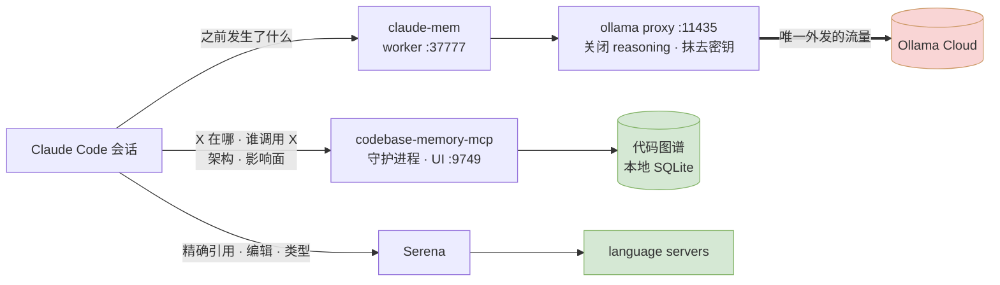

<h1 align="center">Claude Code Stack</h1>

<p align="center">
  <b>为 Claude Code 提供跨会话的持久记忆与真正的代码理解能力 —— 以及让两者不再互相打架的那一条规则。</b>
</p>

<p align="center">
  
  
  
  
</p>

<p align="center">
  <a href="README.md">English</a> ·
  <a href="README.ru.md">Русский</a> ·
  <b>中文</b> ·
  <a href="README.es.md">Español</a>
</p>

---

四个工具，让 Claude Code 拥有能跨会话存活的记忆和代码的结构地图 —— 外加一个全局 `CLAUDE.md` 为它们分工。全部经过端到端安装与验证；其中最有价值的是[坑](#坑)一节，每一条都实打实花过调试时间。

## 目录

- [工具栈](#工具栈) · [它们如何协作](#它们如何协作) · [为什么需要两个代码工具](#为什么需要两个代码工具)
- [安装](#安装) · [验证](#验证)
- [**可直接粘贴的提示词**](#可直接粘贴的提示词) ← 装完从这里开始
- [坑](#坑) · [成本与占用](#成本与占用) · [隐私](#隐私)

## 工具栈

| 工具 | 作用 | 运行形态 |
|---|---|---|
| **[claude-mem](https://github.com/thedotmack/claude-mem)** | 跨会话的**对话记忆**。记录发生过的事，并在会话开始时注入相关的过往工作。 | 本地 worker + SQLite + Chroma |
| **[claude-mem-ollama-proxy](https://github.com/limeflash/claude-mem-ollama-proxy)** | 把 claude-mem 的记忆生成转到 **Ollama Cloud**，关闭 reasoning，并在数据离开本机前**抹去密钥**。 | 本地代理 `127.0.0.1:11435` |
| **[codebase-memory-mcp](https://github.com/DeusData/codebase-memory-mcp)** | 持久化的**代码知识图谱** —— 函数、调用链、路由、跨仓库关联。架构问题毫秒级作答。 | 原生二进制 + 守护进程 |
| **[serena](https://github.com/oraios/serena)** | 实时 **LSP** 符号导航、精确引用查找，以及符号级*编辑*。 | 每个项目一套 language server |

## 它们如何协作



绿色部分全部留在本机。唯一外发的是记忆生成，且必须先经过会剥离凭据的代理。

## 为什么需要两个代码工具

同时装上代码图谱*和* LSP 而不定规则，智能体就会左右摇摆：一个说"读图谱"，另一个说"用 LSP"。[`CLAUDE.md`](CLAUDE.md) 用一句话解决 —— **图谱负责回答问题，Serena 负责修改代码**：

| 问题 | 用哪个 |
|---|---|
| 这在哪？谁调用它？怎么搭起来的？改了会破坏什么？ | **图谱** —— 瞬时响应，覆盖所有已索引仓库，可跨仓库 |
| 动某个符号前的精确引用 · 编辑本身 · 改完的类型错误 | **Serena** —— 读取磁盘上的当前真实状态，且能改代码 |

图谱与文件不一致时，**以文件为准** —— 重新索引，而不是相信过期答案。

## 安装

顺序很重要：代理会修改 `~/.claude-mem/settings.json`，所以 claude-mem 必须先存在。

### 1 · claude-mem

```powershell
npx claude-mem install
```

运行时选 **Worker**。任何 OpenAI 兼容的供应商都行 —— 第 2 步的代理会覆盖它 —— 所以最省钱的做法是直接粘贴一个 **Ollama** 密钥（[ollama.com/settings/keys](https://ollama.com/settings/keys)）。

> 安装器可能以 `Fatal error: ENOENT ... .install-version` 和 npm `ERESOLVE` 警告结束。**两者都无害** —— 见[坑](#坑)。

### 2 · Ollama 代理

```powershell
git clone https://github.com/limeflash/claude-mem-ollama-proxy.git
cd claude-mem-ollama-proxy
.\windows\install.ps1
```

macOS/Linux 用 `./macos/install.sh`。注册登录时启动的计划任务（无需管理员），把 claude-mem 指向 `http://127.0.0.1:11435/v1`，默认模型 `deepseek-v4-flash:0731`。换模型：`-Model "gpt-oss:120b"` —— 列表见 `https://ollama.com/v1/models`。

它会注入 `reasoning_effort: "none"`。否则 reasoning 模型会把答案放进 `reasoning`、让 `content` 为空，claude-mem 便悄无声息地什么都没存。

### 3 · codebase-memory-mcp

```powershell
Invoke-WebRequest -Uri https://raw.githubusercontent.com/DeusData/codebase-memory-mcp/main/install.ps1 -OutFile install.ps1
Unblock-File .\install.ps1
.\install.ps1
```

原生二进制 —— **无需 API 密钥、无需运行时**。语义搜索走内置嵌入，数据不出本机。它会自动配置检测到的所有 agent CLI。

```powershell
codebase-memory-mcp daemon start
codebase-memory-mcp cli index_repository --repo-path C:\path\to\repo
codebase-memory-mcp cli list_projects
```

**每个仓库单独索引**。塞满 `node_modules` 和构建产物的父目录只会生成一坨无用的图，而不是干净的分项目图谱。

### 4 · Serena

```powershell
uv tool install --from git+https://github.com/oraios/serena serena-agent
claude mcp add serena -s user -- serena start-mcp-server --context claude-code --project-from-cwd --enable-web-dashboard False
```

想锁定版本，在仓库 URL 后加 `@v1.7.0`。之后升级加 `--force`；若删不掉旧的工具目录，见[坑](#坑)。

### 5 · 全局指令

把 [`CLAUDE.md`](CLAUDE.md) 复制到 `~/.claude/CLAUDE.md`。它会自动加载进每个会话，无需你多说一句话。

即使你用别的语言工作，也**保持它是英文** —— 那是给智能体读的配置，不是给你看的文档。

## 验证

```powershell
Get-ScheduledTask -TaskName claude-mem-ollama-proxy
Get-Content "$env:USERPROFILE\.claude-mem-proxy\proxy.log" -Tail 5
# 健康日志：POST /v1/chat/completions -> 200 [reasoning_effort=none]

Invoke-WebRequest http://localhost:37777 -UseBasicParsing | Select-Object StatusCode

codebase-memory-mcp daemon status
codebase-memory-mcp cli list_projects        # UI: http://127.0.0.1:9749
```

在 Claude Code 里执行 `/mcp`，应能看到 `serena` 和 `codebase-memory-mcp`。**MCP 服务器只在启动时连接 —— 装完请重启 Claude Code。**

## 可直接粘贴的提示词

直接复制进会话。语言无所谓 —— 你平时用什么写就用什么。更多见 [`PROMPT.md`](PROMPT.md)。

### 定位 —— 进入新仓库后的第一条消息

```text
这台机器上有两个代码智能服务。请使用它们，而不是 grep 整个目录树或通读文件。
图谱（codebase-memory-mcp）负责回答问题。Serena 负责修改代码。

1. 先调用 list_projects。如果当前仓库未被索引，先用 index_repository 索引它，再做其他任何事。
   如果已索引但本会话之外发生了大改动 —— git pull、切分支、rebase，或守护进程曾经停摆 —— 也要重新索引：
   watcher 只有在实际运行时才保持图谱新鲜，而过期的图谱不会报错，只会悄悄骗你。
2. 遇到"X 在哪 / 谁调用 X / 这是怎么搭的 / 改了 X 会坏什么"，使用 get_architecture、search_graph、
   trace_path、query_graph、get_code_snippet。语义搜索是 search_graph 的一种模式
   （semantic_query=["a","b"]），不是独立工具。结构性问题不要退回去用 Grep/Glob。
3. Serena 一次只持有一个项目。如果要修改的文件不在本会话的工作目录内，先调用
   activate_project("<仓库路径>")，否则跑起来的是错误的 language server。然后用 find_referencing_symbols
   拿到精确引用，用 replace_symbol_body / insert_after_symbol / rename_symbol / safe_delete_symbol 修改，
   最后执行 get_diagnostics_for_file。
4. 图谱与文件不一致时以文件为准 —— 重新索引，不要相信过期答案。

请先基于图谱给我一份该仓库的简短架构概述，并告诉我上述哪些能力当前不可用。
```

最后一句很关键：没有它，缺失的 MCP 服务器会变成智能体默默 grep 并假装一切正常。

### 健康检查 —— 感觉哪里不对时

```text
检查我的环境，告诉我实际坏了什么，而不是本该有什么：
- codebase-memory-mcp 守护进程是否在运行？索引了多少个项目？
- serena 是否已连接？
- claude-mem worker 在 http://localhost:37777 是否响应？
- ~/.claude-mem-proxy/proxy.log 是否有近期的 "-> 200 [reasoning_effort=none]" 记录？
对每个故障给出原因和修复方法 —— 不要只是重启了事。
```

### 在新机器上部署

```text
阅读本仓库的 README，按给定顺序在这台机器上部署整套环境。
遇到任何需要付费密钥的步骤先停下来问我。完成后运行健康检查并展示结果。
```

### 批量索引仓库

```text
把 <路径> 下的所有 git 仓库索引进代码图谱。每个仓库单独索引 —— 不要索引包含多个仓库的父目录 ——
并跳过空壳、归档，以及只有构建产物或数据集的目录。然后展示项目列表及其节点数和边数。
```

## 别让 claude-mem 卡住你的输入

claude-mem 的 `UserPromptSubmit` 钩子是**同步**的。worker 不可达时它以非零码退出，Claude Code 就会**拦下你的提示词** —— 真实发生过，连续 77 条被拒。插件把自己的 `PostToolUse`、`PreToolUse`、`Stop` 都标了 `"async": true`（无法阻塞），偏偏挡在你和键盘之间的那一个没有标。

而且它会死锁：worker 挂掉，但 `:37777` 上的监听套接字被存活的子进程继承而幸存，启动器看到端口被占便记录 `Port already in use, refusing to start duplicate`，健康检查无人应答，于是每个钩子都失败 —— 永远如此。

两层防护，都在 [`watchdog/`](watchdog)：

**1. 钩子加固 —— 保证。** [`harden-hooks.js`](watchdog/harden-hooks.js) 把阻塞型钩子包进子 shell：

```bash
node watchdog/harden-hooks.js ~/.claude/plugins/cache/thedotmack/claude-mem/<版本>/hooks/hooks.json
```

原命令里的 `exit 1` 现在只结束子 shell，末尾的 `exit 0` 照常执行 —— 于是 worker 挂掉的代价是漏掉几条观察记录，而不是夺走你打字的能力。幂等；插件更新后需重新执行，因为缓存会被覆盖。

**2. 看门狗 —— 恢复。** 把 [`claude-mem-watchdog.ps1`](watchdog/claude-mem-watchdog.ps1) 注册为计划任务，每 5 分钟探测 `:37777`，不健康就杀掉卡死的 worker 并重启。若你主动禁用了插件，它不会擅自复活；它绝不碰你的 Claude Code 会话；除非端口占用者确实是 claude-mem worker，否则一律跳过 —— `.claude-mem-proxy` 进程会被幼稚的 `*claude-mem*` 过滤器命中，绝不能误杀。

```powershell
$s = "$env:USERPROFILE\.claude-mem-watchdog\watchdog.ps1"
$a = New-ScheduledTaskAction -Execute powershell.exe -Argument "-NoProfile -ExecutionPolicy Bypass -WindowStyle Hidden -File `"$s`""
$t = New-ScheduledTaskTrigger -Once -At (Get-Date).AddMinutes(1) -RepetitionInterval (New-TimeSpan -Minutes 5)
Register-ScheduledTask -TaskName claude-mem-watchdog -Action $a -Trigger $t
```

**当端口属主 PID 已不存在时**，句柄是被某个比 worker 活得更久的子进程继承了。实测中那个子进程正是 claude-mem 自己的 Chroma 栈 —— `chroma-mcp.exe` 及其 python worker，在 worker 死后被遗弃 —— **而不是**编辑器会话。看门狗会杀掉它们，然后用真正的 bind 测试证明端口确实被收回，再重启 worker；`netstat` 里的 `LISTENING` 行两个方向都不能作为证据。若仍有它无法识别的进程占着端口，它会记录下来并停手，而不是乱杀一气。

## 坑

以下每一条都真实发生过。

| 现象 | 原因 | 处理 |
|---|---|---|
| `npx claude-mem install` 以 `Fatal error: ENOENT ... marketplaces\thedotmack\plugin\.install-version` 结束 | 路径小 bug —— 文件其实写在上一层 | **忽略。** 确认插件缓存里有 `node_modules` 且 MCP 有响应 |
| …以及 npm `ERESOLVE` 的 tree-sitter 冲突 | 重复安装**仅开发用**的语法包；运行时依赖已由 `bun` 装好 | **忽略** |
| 记忆生成费用高得离谱 | 默认路径按 observation 计费（Haiku ≈ $58/千，OpenRouter ≈ $8/千） | 用代理 —— 生成转到你的 Ollama Cloud 余额 |
| claude-mem 什么都没存，也没报错 | reasoning 模型把文本放进了 `reasoning`，`content` 为空 | 代理注入的 `reasoning_effort: "none"` |
| `codebase-memory-mcp` 安装退出码 1，PATH 从未注册 | 单个 agent 配置失败会中断整个激活流程。`%LOCALAPPDATA%\hermes\config.yaml` 处的 **Hermes** 配置必然失败，与内容无关 —— [issue #1656](https://github.com/DeusData/codebase-memory-mcp/issues/1656) | 删除/改名该目录，或手动把安装目录加进 PATH。其他 agent 配置正常 |
| `daemon status` 显示 "not running"，但 :9749 的 UI 有响应 | 多个守护进程互相竞争，通常来自反复 `install --force` | `daemon stop`，杀掉残留的 `codebase-memory-mcp.exe`，再执行一次 `daemon start` |
| 图谱答案看起来过时 | `auto_watch=true` 只刷新**已索引**项目，而 `auto_index=false` —— 新仓库永远不会被自动收录 | 每个新仓库执行一次 `index_repository` |
| **提示词发不出去**：`A hook blocked your prompt … claude-mem worker unreachable for N consecutive hooks` | worker 已死但 `:37777` 套接字幸存，启动器拒绝启动副本，健康检查失败 —— 同步的 `UserPromptSubmit` 钩子于是阻塞输入。自我维持的死锁 | 先禁用插件恢复打字，再应用 [`watchdog/`](watchdog)。见[上一节](#别让-claude-mem-卡住你的输入) |
| 端口的监听者 PID 根本不存在（`taskkill: process not found`） | 孤儿套接字 —— 句柄被子进程继承并比属主活得更久。对 claude-mem 而言元凶是它自己的 `chroma-mcp.exe` 和 python worker，在 worker 死后仍在运行 | 杀掉这些辅助进程，再用真正的 bind（`[System.Net.Sockets.TcpListener]`）确认 —— 最后一个句柄关闭前，`netstat` 仍会列出这个幽灵。无需重启 |
| Serena 在 TypeScript（或其他语言）文件上报 `Cannot extract symbols from <文件>. Active language servers: ['python']` | **不是缺少语言支持。** Serena 一次只持有一个项目并绑定到会话的工作目录，因此只启动了该项目的 language server | 调用 `activate_project("<仓库路径>")` 后重试。已验证：激活 TS 仓库后 `typescript` 服务器启动，符号提取正常 |
| 智能体声称 `semantic_query` / `activate_project`「不存在」 | `semantic_query` 是 **`search_graph` 的参数**而非工具，所以在工具列表里搜不到。`activate_project` 确实存在，只是关键词检索排序靠后 | 用 `search_graph(semantic_query=["a","b"])`；按精确名称选择 `activate_project` |
| 明明改了很多文件，`detect_changes` 却返回 `seed_symbols: 0` | 它对比的是 `base_branch`（默认 `main`）或 `since` —— 未提交的工作区改动解析不出符号 | 先提交，或传入正确的 `base_branch`/`since`，或改用 `trace_path` 评估影响面 |
| `uv tool install --force` 报错：*"failed to remove directory … reparse point … (os error 4395)"* | 报错有误导性 —— 通常根本没有 reparse point。先停掉所有 `serena.exe`；仍失败则需强制删除目录 | `robocopy <空目录> <工具目录> /MIR`，再 `rmdir /s /q`，然后重装 |
| **所有插件突然显示 `Disabled` 且无法重新启用** | 有东西把 `~/.claude/settings.json` 重写成了带 **BOM** 的 UTF-8 —— PowerShell 5.1 的 `Set-Content -Encoding UTF8` 正是如此。开头的 `EF BB BF` 会让严格的 JSON 解析器整份文件都拒绝，于是里面所有设置全部失效 | 去掉 BOM 重写：`node -e "const f=require('fs'),p='<文件>';let s=f.readFileSync(p,'utf8');if(s.charCodeAt(0)===0xFEFF)s=s.slice(1);f.writeFileSync(p,JSON.stringify(JSON.parse(s),null,2))"`。切勿用 `Set-Content -Encoding UTF8` 往返写 Claude 的配置；改用 `[System.IO.File]::WriteAllText($p,$json,(New-Object System.Text.UTF8Encoding($false)))` |
| PowerShell 5.1 脚本报 *"The property cannot be found on this object"* | 在 5.1 上，对 `ConvertFrom-Json` 对象中不存在的键做 `$json.NewKey = value` 会抛异常 | 改用 `Add-Member -NotePropertyName ... -Force` |
| 路径变量变成了类似 `MSFT_TaskSettings3` 的东西 | PowerShell 变量名**不区分大小写** —— `$settings` 会悄悄覆盖 `$Settings` | 重命名其中一个 |
| 原生 `.exe` 的输出显示为红色 `NativeCommandError` | PowerShell 会这样包装原生程序的 stderr；程序并没有失败 | 看退出码，别看颜色 |

## 成本与占用

**codebase-memory-mcp** 和 **Serena** 免费且完全本地。只有 **claude-mem** 按 observation 计费 —— 接上代理后走你的 Ollama Cloud 余额。

| | 磁盘 | 内存 |
|---|---|---|
| codebase-memory-mcp | 282 MB 二进制 + 图谱缓存（19 个仓库 / 11.1 万节点约 450 MB） | 一个守护进程 |
| Serena | 很小 | 多会话并存时含 language server 约 1.6 GB |
| claude-mem | SQLite + Chroma，随使用增长 | worker + 嵌入栈 |

## 隐私

图谱与 Serena 完全本地。claude-mem **确实**会把对话内容发给模型 —— 代理在转发前扫描消息体，把凭据替换为 `[SECRET:{type}]`，触发时日志会出现 `[redacted: ...]`。请保持 `CMP_REDACT` 开启。

## 许可

[MIT](LICENSE)。文中提及的四个工具各自遵循其自身许可。
