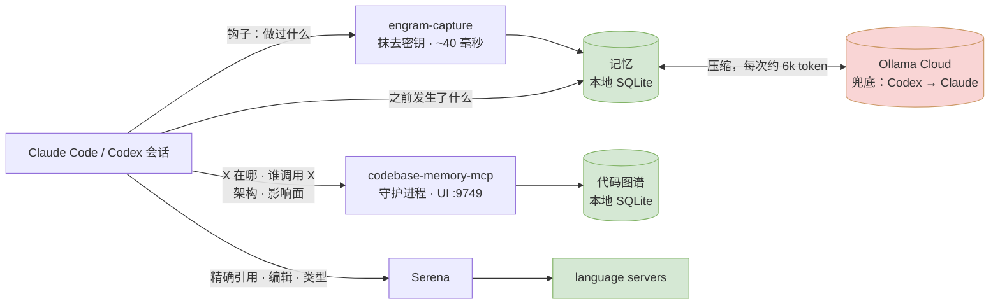

<h1 align="center">Claude Code Stack</h1>

<p align="center">
  <b>为 Claude Code 提供跨会话的持久记忆与真正的代码理解能力 —— 以及让两者不再互相打架的那一条规则。</b>
</p>

<p align="center">
  
  
  
  
</p>

<p align="center">
  <a href="README.md">English</a> ·
  <a href="README.ru.md">Русский</a> ·
  <b>中文</b> ·
  <a href="README.es.md">Español</a>
</p>

---

三个工具，让 Claude Code 拥有能跨会话存活的记忆和代码的结构地图 —— 外加一个全局 `CLAUDE.md` 为它们分工。全部经过端到端安装与验证；其中最有价值的是[坑](#坑)一节，每一条都实打实花过调试时间。

## 目录

- [工具栈](#工具栈) · [它们如何协作](#它们如何协作) · [为什么需要两个代码工具](#为什么需要两个代码工具)
- [安装](#安装) · [验证](#验证)
- [**可直接粘贴的提示词**](#可直接粘贴的提示词) ← 装完从这里开始
- [**如何选择模型**](#如何选择模型) —— 实测而非猜测
- [**为什么不再用 claude-mem**](#为什么不再用-claude-mem) —— 两个月用下来的教训
- [坑](#坑) · [成本与占用](#成本与占用) · [隐私](#隐私)

## 工具栈

| 工具 | 作用 | 运行形态 |
|---|---|---|
| **[quipu](https://github.com/limeflash/quipu)** | 跨会话的**自己会写的记忆**。钩子记录智能体做了什么，便宜的云端模型把它压缩成寥寥几条记录，同一仓库的下一个会话就带着它们开场。是 [engram](https://github.com/Gentleman-Programming/engram) 的分叉，所以智能体也能自己搜索和保存。 | 一个 Go 二进制 + SQLite，运行在 MCP 服务器内 |
| **[codebase-memory-mcp](https://github.com/DeusData/codebase-memory-mcp)** | 持久化的**代码知识图谱** —— 函数、调用链、路由、跨仓库关联。架构问题毫秒级作答。 | 原生二进制 + 守护进程 |
| **[serena](https://github.com/oraios/serena)** | 实时 **LSP** 符号导航、精确引用查找，以及符号级*编辑*。 | 每个项目一套 language server |

## 它们如何协作


```mermaid
flowchart LR
    CC["Claude Code / Codex 会话"]

    CC -->|"钩子：做过什么"| CAP["engram-capture<br/>抹去密钥 · ~40 毫秒"]
    CAP --> MEM[("记忆<br/>本地 SQLite")]
    MEM <-->|"压缩，每次约 6k token"| OC[("Ollama Cloud<br/>兜底：Codex → Claude")]
    CC -->|"之前发生了什么"| MEM

    CC -->|"X 在哪 · 谁调用 X<br/>架构 · 影响面"| CBM["codebase-memory-mcp<br/>守护进程 · UI :9749"]
    CBM --> GR[("代码图谱<br/>本地 SQLite")]

    CC -->|"精确引用 · 编辑 · 类型"| SR["Serena"]
    SR --> LS["language servers"]

    style OC fill:#f9d5d5,stroke:#c96
    style MEM fill:#d5e8d4,stroke:#82b366
    style GR fill:#d5e8d4,stroke:#82b366
    style LS fill:#d5e8d4,stroke:#82b366
```

绿色部分全部留在本机。唯一外发的流量是记忆压缩，而凭据在钩子里就被剥离 —— 早在事件写入磁盘之前。

## 为什么需要两个代码工具

同时装上代码图谱*和* LSP 而不定规则，智能体就会左右摇摆：一个说"读图谱"，另一个说"用 LSP"。[`CLAUDE.md`](CLAUDE.md) 用一句话解决 —— **图谱负责回答问题，Serena 负责修改代码**：

| 问题 | 用哪个 |
|---|---|
| 这在哪？谁调用它？怎么搭起来的？改了会破坏什么？ | **图谱** —— 瞬时响应，覆盖所有已索引仓库，可跨仓库 |
| 动某个符号前的精确引用 · 编辑本身 · 改完的类型错误 | **Serena** —— 读取磁盘上的当前真实状态，且能改代码 |

图谱与文件不一致时，**以文件为准** —— 重新索引，而不是相信过期答案。

记忆是另一个问题 —— *我们之前做过什么、决定过什么* —— 所以它与二者都不冲突。

## 安装

### 1 · quipu（记忆）

从源码构建；需要 Go 1.25+。

```powershell
git clone https://github.com/limeflash/quipu.git
cd quipu
$bin = "$env:LOCALAPPDATA\Programs\engram"
go build -o "$bin\engram.exe" ./cmd/engram
go build -ldflags "-s -w" -o "$bin\engram-capture.exe" ./cmd/engram-capture
[Environment]::SetEnvironmentVariable('Path', [Environment]::GetEnvironmentVariable('Path','User') + ";$bin", 'User')   # 新开的终端才会生效

New-Item -ItemType Directory -Force "$HOME\.engram" | Out-Null
Set-Content "$HOME\.engram\autocapture.json" '{}'      # 开启捕获
Set-Content "$HOME\.engram\ollama.key" '<your key>'    # 来自 ollama.com/settings/keys
```

二进制保留 engram 这个名字。接下来：

- 把 [`docs/fork/claude-settings.json`](https://github.com/limeflash/quipu/blob/main/docs/fork/claude-settings.json) 合并进 `~/.claude/settings.json` —— 在 `PostToolUse` / `UserPromptSubmit` / `Stop` 上捕获，在 `SessionStart` 上载入记忆；
- 注册 MCP 服务器（只读工具集 —— 智能体读取记忆，而不会被催着去写）：

```powershell
claude mcp add engram -s user -- "$env:LOCALAPPDATA\Programs\engram\engram.exe" mcp --tools=mem_search,mem_context,mem_get_observation,mem_timeline,mem_current_project,mem_list_projects
```

- **Codex** 也一样：把 [`docs/fork/codex-config.toml`](https://github.com/limeflash/quipu/blob/main/docs/fork/codex-config.toml) 追加到 `~/.codex/config.toml`，然后在交互式 `codex` 里批准一次新钩子。
- **兜底**：Ollama 配额用完时，只要 `codex` 已登录，Codex 就能顶上；Claude 则把 `claude setup-token` 的输出保存到 `~/.engram/claude.token`。
- **从 claude-mem 迁移：** 先 `engram import claude-mem --dry-run --root <你的仓库目录>`，再去掉 `--dry-run` 正式执行。

其余一切 —— 配置、命令、记录如何排序 —— 见 [quipu README](https://github.com/limeflash/quipu#readme)。

### 2 · codebase-memory-mcp

```powershell
Invoke-WebRequest -Uri https://raw.githubusercontent.com/DeusData/codebase-memory-mcp/main/install.ps1 -OutFile install.ps1
Unblock-File .\install.ps1
.\install.ps1
```

原生二进制 —— **无需 API 密钥、无需运行时**。语义搜索走内置嵌入，数据不出本机。它会自动配置检测到的所有 agent CLI。

```powershell
codebase-memory-mcp daemon start
codebase-memory-mcp cli index_repository --repo-path C:\path\to\repo
codebase-memory-mcp cli list_projects
```

**每个仓库单独索引**。塞满 `node_modules` 和构建产物的父目录只会生成一坨无用的图，而不是干净的分项目图谱。

### 3 · Serena

```powershell
uv tool install --from git+https://github.com/oraios/serena@9f9db76622340930d66aba9f72a2349b30bb1e29 serena-agent
claude mcp add serena -s user -- serena start-mcp-server --context claude-code --project-from-cwd --enable-web-dashboard False
```

**请保留这个固定版本。** 它是 1.x 线的最后一个提交（2026-09-06，版本号 `1.7.1.dev0`）。自 2026-09-15 起，Serena 的 `main` 是尚未发布的 `2.0.0.dev0`：其中 `activate_project` 必须传入 `session_id`，而 [`CLAUDE.md`](CLAUDE.md) 的规则不会传，应用本身也改为 GPL-3.0 许可。等 2.0 正式发布、规则相应调整后再移动固定点。重装或升级时加 `--force`；若删不掉旧的工具目录，见[坑](#坑)。

### 4 · 全局指令

把 [`CLAUDE.md`](CLAUDE.md) 复制到 `~/.claude/CLAUDE.md`。它会自动加载进每个会话，无需你多说一句话。

即使你用别的语言工作，也**保持它是英文** —— 那是给智能体读的配置，不是给你看的文档。

## 验证

```powershell
engram autocapture probe         # 对链中每个模型各发一次极小调用：每行应为 "ok"
engram autocapture status        # 缓冲应排空至 0；按天显示 调用数 / token / 记录数

codebase-memory-mcp daemon status
codebase-memory-mcp cli list_projects        # UI: http://127.0.0.1:9749
```

在 Claude Code 里执行 `/mcp`，应能看到 `engram`、`serena` 和 `codebase-memory-mcp`；在已索引的仓库里新开会话，一旦有值得记住的内容，开头就会出现一个 `<engram-memory project="…">` 块。**MCP 服务器只在启动时连接 —— 装完请重启 Claude Code。**

## 可直接粘贴的提示词

直接复制进会话。语言无所谓 —— 你平时用什么写就用什么。更多见 [`PROMPT.md`](PROMPT.md)。

### 定位 —— 进入新仓库后的第一条消息

```text
这台机器上有两个代码智能服务。请使用它们，而不是 grep 整个目录树或通读文件。
图谱（codebase-memory-mcp）负责回答问题。Serena 负责修改代码。

1. 先调用 list_projects。如果当前仓库未被索引，先用 index_repository 索引它，再做其他任何事。
   如果已索引但本会话之外发生了大改动 —— git pull、切分支、rebase，或守护进程曾经停摆 —— 也要重新索引：
   watcher 只有在实际运行时才保持图谱新鲜，而过期的图谱不会报错，只会悄悄骗你。
2. 遇到"X 在哪 / 谁调用 X / 这是怎么搭的 / 改了 X 会坏什么"，使用 get_architecture、search_graph、
   trace_path、query_graph、get_code_snippet。语义搜索是 search_graph 的一种模式
   （semantic_query=["a","b"]），不是独立工具。结构性问题不要退回去用 Grep/Glob。
3. Serena 一次只持有一个项目。会话在某个仓库内启动时，Serena 整个会话都绑定该仓库 —— activate_project
   被有意禁用，其他仓库的文件它无法触及。会话在任何仓库之外启动时，先调用 activate_project("<仓库路径>")
   再做第一次查找。然后用 find_referencing_symbols
   拿到精确引用，用 replace_symbol_body / insert_after_symbol / rename_symbol / safe_delete_symbol 修改，
   最后执行 get_diagnostics_for_file。
4. 图谱与文件不一致时以文件为准 —— 重新索引，不要相信过期答案。

请先基于图谱给我一份该仓库的简短架构概述，并告诉我上述哪些能力当前不可用。
```

最后一句很关键：没有它，缺失的 MCP 服务器会变成智能体默默 grep 并假装一切正常。

### 健康检查 —— 感觉哪里不对时

```text
检查我的环境，告诉我实际坏了什么，而不是本该有什么：
- codebase-memory-mcp 守护进程是否在运行？索引了多少个项目？
- serena 和 engram 是否已连接？
- `engram autocapture probe` 是否通过？`engram autocapture status` 是否显示缓冲在排空、
  近期的模型调用没有报错？
对每个故障给出原因和修复方法 —— 不要只是重启了事。
```

### 回忆 —— 之前发生了什么

```text
开始之前：在记忆里搜索本项目中——如果这里没有，就去其他项目里——关于 <主题> 做过什么、决定过什么
（mem_search，all_projects=true）。完整打开最相关的几条记录，告诉我哪些仍然适用——两者不一致时以代码为准。
```

### 在新机器上部署

```text
阅读本仓库的 README，按给定顺序在这台机器上部署整套环境。
遇到任何需要付费密钥的步骤先停下来问我。完成后运行健康检查并展示结果。
```

### 批量索引仓库

```text
把 <路径> 下的所有 git 仓库索引进代码图谱。每个仓库单独索引 —— 不要索引包含多个仓库的父目录 ——
并跳过空壳、归档，以及只有构建产物或数据集的目录。然后展示项目列表及其节点数和边数。
```

## 让代码图谱保持存活

`codebase-memory-mcp` 守护进程需要一套刻意设计的保活机制，这里有个陷阱：守护进程和 CLI 通过一个命名管道互相寻找，而管道名是**启动上下文的哈希**。

```
由计划任务启动 : cbm-daemon-bc0bed48…
由会话内启动   : cbm-daemon-2a438ffc…
```

因此由计划任务启动的守护进程运行正常、占着 UI 端口，却**永远不可见** —— `daemon status` 在一个活着的进程旁边报告 "not running"。于是 CLI 每条命令都另起一个一次性守护进程，它们互相竞争，直到注册表卡死、项目列表变空。各项目的 `.db` 文件从不受影响，坏掉的只有注册表。

所以改由 **Claude Code 的 SessionStart 钩子**维持它 —— 那个上下文里管道名是匹配的：[`ensure-cbm-daemon.ps1`](hooks/ensure-cbm-daemon.ps1)，外加即发即忘的包装 [`cbm-daemon-ensure.cmd`](hooks/cbm-daemon-ensure.cmd)。把两者复制到 `~/.claude/hooks/`，并在 `~/.claude/settings.json` 的每个 `SessionStart` matcher 上注册该包装：

```json
{ "type": "command", "command": "cmd.exe /d /v:off /s /c '\"\"%USERPROFILE%\\.claude\\hooks\\cbm-daemon-ensure.cmd\"\"'", "timeout": 10 }
```

包装约 40 毫秒即以退出码 0 返回 —— 真正的工作被分离出去，所以再慢或失败的修复也不会拖慢或阻塞会话。而且它只在会话启动时运行，守护进程正好在有人需要时才存在。只有携带守护进程标记的进程才会被停止；没带标记的是存活会话所拥有的 MCP 服务器。日志写入 `~/.claude/hooks/cbm-daemon.log`。

## 如何选择模型

**用 `deepseek-v4.1-flash`** —— quipu 的默认模型，后面兜底的是 `glm-5.3-flash`。这是实测而非猜测：取本机八段真实会话（正确答案已知），只看摘要有没有留住关键事实。

| | **deepseek-v4.1-flash** | glm-5.3-flash | deepseek-v4-flash:0731（已下线） |
|---|---|---|---|
| 保住的事实 | **10/10** | 10/10 | 7/10 |
| 每次调用 token | **~62** | ~480 | ~44 |
| 延迟 | **0.6 秒** | 5.2 秒 | 0.9 秒 |
| 每次调用消耗的会话配额 | **< 0.007%** | ~0.020% | — |

已下线的 `0731` 把「273 次尝试、266 次失败、5 次成功」里的 `266` 丢了，还自相矛盾；在那段花了两小时才弄清的会话里，它没有记下那次关闭是**设计如此**——而这正是全部结论。`glm-5.3-flash` 修正了这一点；`deepseek-v4.1-flash` 保住的事实相同，token 与延迟只有其八分之一，配额最多三分之一，人工阅读甚至更干净——GLM 在一条摘要里编造了「on locked dirs」。

### 思考型模型必须走原生端点

Ollama 的 OpenAI 兼容 `/v1/chat/completions` 不接受 `think` 参数（[ollama#15288](https://github.com/ollama/ollama/issues/15288)、[#15293](https://github.com/ollama/ollama/issues/15293)），所以思考型模型要么把思考写进 `content`——1300–1600 字的「The user wants me to compress…」——要么返回空 `content`。quipu 只走原生 `/api/chat`，并带 `think: false`——只有 `ollama.think` 中列出的模型前缀（默认 `glm-`）例外，它们用 `think: true`：这样思考会放进独立的 `thinking` 字段，`content` 留给答案，而 `false` 只是把絮叨塞回 `content`。Ollama 还会忽略 `format` 里的 JSON schema，所以回复在本地校验，并有一轮修复机会。

### 实际花多少——以及本仓库错在哪里

Ollama Cloud 是订阅制：token 不等于钱。真正会耗尽的是**配额**——5 小时会话限额和周限额，按模型加权而非按 token 计，并由账户下所有模型共享。

本节早先的版本根据 0.5% 的周用量，承诺「用 GLM 约 1%，余量约 100 倍」。**这是错的。** 那次读数恰好在周窗口重置之后——计数器只有 271 次请求——然后据此外推。整周跑 GLM 产生了 4,386 次 GLM 请求和 1,990 次其他请求，周配额达到 **100%**：

```
          200     429（配额）   410（模型下线）
09-19     863        6,876            0
09-24     207       26,109            0
09-25       1       21,142        6,427
```

配额是账户级的，所有模型同时返回 429，兜底模型也无济于事，而 claude-mem 不停重试——每天多达 26,000 次被拒——近一周没有写入记忆。正因如此，quipu 绝不在循环里反复重试被拒的模型：一次 429 会让该模型停用 15 分钟，每次翻倍，最长 2 小时，这一批则顺着链条往下走。第二个 Ollama 模型通常也会拒绝——配额是账户级的——于是工作落到 **Codex**（`gpt-6-luna`，你的 ChatGPT 套餐），再到 **Claude**（`claude-sonnet-5-5`，你的 Claude 套餐），各自每小时最多 20 次调用。410（服务商已下线该模型）会让该模型永久停用。`engram autocapture status` 显示每个模型当前的状态。

## 为什么不再用 claude-mem

直到 2026 年 10 月，这套组合还在跑 [claude-mem](https://github.com/thedotmack/claude-mem)，前面挂着一个把生成转到 Ollama Cloud 并抹去密钥的[代理](https://github.com/limeflash/claude-mem-ollama-proxy)（现已归档），外加一个让它的 worker 保持存活的看门狗。它确实管用 —— 仅代理一项，两周里就抹掉了 **4,192 条凭据**，否则这些凭据会原封不动地发给第三方模型 —— 但这份清单里的每一件东西，都是为了给某个问题打补丁：

- 它同步的 `UserPromptSubmit` 钩子在 worker 挂掉时会**拦下提示词** —— 有一次连续被拒 77 条；
- 死掉的 worker 的套接字被孤儿 Chroma 进程继承，worker 因此无法重启，看门狗不得不学会把这种情况和正常的空闲关闭区分开 —— 两周里它**判断错了 273 次**，每五分钟闪一次控制台窗口；
- 数据库因为一个没人用的云同步 outbox 膨胀到数 GB；
- 每次生成调用都会发送累积历史的约 **15 万输入 token**；10 月 5 日这一天就达到 **27 亿** token。

quipu 把这一切都换掉了：钩子只写一个文件就退出，压缩在本来就在运行的 MCP 服务器里完成，调用是无状态的。在同样四段会话上实测，数据取自 10 月 7 日 —— claude-mem 用到被关掉为止，之后是 quipu：

| | claude-mem | quipu |
|---|---|---|
| 每工作一小时的记录数 | 270–330 | 36–66 |
| 只是复述读过的代码的笔记 | 65% | 29% |
| 当天输入 token | 343.6 M（平均 152k / 次调用） | 0.72 M（平均 6.4k / 次调用） |
| 随机抽 60 条记录的盲审：有用 / 噪声 / 重复 | 14 / 45 / 1 | 45 / 11 / 4 |

绝对数量上，claude-mem 每小时产出的有用记录仍然更多（约 70 对约 37）—— 只是每一条都埋在三条噪声底下。claude-mem 的全部历史（4.9 万条记录、1.5 千条摘要、3.1 千条提示词）已用 `engram import claude-mem` 导入，所以切换没有丢任何东西。

## 坑

以下每一条都真实发生过。

| 现象 | 原因 | 处理 |
|---|---|---|
| 新的 quipu 钩子在 **Codex** 里毫无反应 | Codex 只有在你信任过一次之后，才会运行新增或改动过的钩子 | 启动交互式 `codex`，批准这些钩子 |
| Codex `exec` 写了事件，却从不写回合摘要 | `codex exec` 在 `async` 的 Stop 钩子结束之前就退出了 | 保持 `Stop` 同步 —— 随附配置就是这样 |
| 带引号或空格的 Codex 钩子命令失败 | Codex 默认通过 `cmd.exe` 运行钩子命令 | 用不带引号的普通路径，如随附配置所示 |
| 重新构建 `engram.exe` 报 "access denied" | 每个 Claude Code 和 Codex 会话都通过各自的 MCP 服务器占着这个二进制；Windows 拒绝覆盖正在运行的 `.exe` | 先把旧的改名，再拷入新的 —— 正在运行的映像允许改名。会话重启后删掉 `*.old-*.exe` |
| Claude 兜底返回 `401` | 在 Claude Code 会话内，子进程 `claude -p` 继承了指向父进程凭据的 `ANTHROPIC_*` / `CLAUDE*` 变量 | quipu 会把它们清掉，只使用 `claude setup-token` 生成的 `~/.engram/claude.token` |
| 在 Windows 上，PostToolUse 钩子带来肉眼可见的延迟 | 进程启动耗时随映像大小增长：30 MB 的二进制约 110 毫秒，2 MB 的 19 毫秒 | 所以捕获是单独的 3 MB `engram-capture`；钩子要保持 `async` |
| `codebase-memory-mcp` 安装退出码 1，PATH 从未注册 | 单个 agent 配置失败会中断整个激活流程。`%LOCALAPPDATA%\hermes\config.yaml` 处的 **Hermes** 配置必然失败，与内容无关 —— [issue #1656](https://github.com/DeusData/codebase-memory-mcp/issues/1656) | 删除/改名该目录，或手动把安装目录加进 PATH。其他 agent 配置正常 |
| `daemon status` 显示 "not running"，但 :9749 的 UI 有响应 | 多个守护进程互相竞争，通常来自反复 `install --force` | `daemon stop`，杀掉残留的 `codebase-memory-mcp.exe`，再执行一次 `daemon start` |
| **图谱 UI 里项目列表为空**，或者 `daemon status` 报 "not running" 而 `codebase-memory-mcp.exe` 明明活着并在服务 `:9749` | 守护进程是从管道名哈希与 CLI 不一致的上下文启动的 —— 通常是计划任务。它在运行却永远找不到，于是每条 CLI 命令都另起一次性守护进程，彼此竞争直到注册表卡死 | 数据没事 —— 各项目的 `.db` 文件完好。杀掉所有带 `--cbm-daemon-internal` 标记的进程（只杀这些；不带标记的是会话自有的 MCP 服务器），然后**在会话内的终端里**执行 `daemon start`。用 [SessionStart 钩子](#让代码图谱保持存活)自动化 |
| 图谱答案看起来过时 | `auto_watch=true` 只刷新**已索引**项目，而 `auto_index=false` —— 新仓库永远不会被自动收录 | 每个新仓库执行一次 `index_repository` |
| 智能体运行 `codebase-memory-mcp cli …` 时永远卡住，CPU 0% | CLI 也会从 stdin 读取 JSON 参数（`echo '<json>' \| codebase-memory-mcp cli <tool>`），只要 stdin 不是终端就会等待 EOF —— 而智能体的 shell 工具从不发送。实测：关闭 stdin 用时 4 秒，让 stdin 保持打开 15 秒则用时 16 秒 | 关闭 stdin：`codebase-memory-mcp cli list_projects < /dev/null`。在 macOS 上的 Claude Code 中遇到 |
| 把 `codebase-memory-mcp` 升级到 0.11 并重新索引后，每个仓库都出现两次 | 0.11 按完整路径命名项目（根路径中的 `/` 换成 `-`，例如 `Users-<you>-Projects-<repo>`），不再用文件夹名，所以重新索引会在旧项目旁新建一个 —— 旧项目的过期图谱仍会被搜到 | 对每个短名称的重复项执行 `delete_project --project <旧名称>`。它们只含可再生的图谱数据；若用 `manage_adr` 存过 ADR，先把它们导出。升级本身请重新运行第 2 步的安装脚本：`update` 只会指向它的一份本地副本，而 0.11 之前的安装从未放置过 |
| 端口的监听者 PID 根本不存在（`taskkill: process not found`） | 孤儿套接字 —— 句柄被子进程继承并比属主活得更久 | 杀掉残存的子进程，再用真正的 bind（`[System.Net.Sockets.TcpListener]`）确认 —— 最后一个句柄关闭前，`netstat` 仍会列出这个幽灵。无需重启 |
| Serena 在 TypeScript（或其他语言）文件上报 `Cannot extract symbols from <文件>. Active language servers: ['python']` | **不是缺少语言支持。** Serena 一次只持有一个项目并绑定到会话的工作目录，因此只启动了该项目的 language server | 会话在仓库外启动：调用 `activate_project("<仓库路径>")` 后重试 —— 已验证，激活 TS 仓库后 `typescript` 服务器启动，符号提取正常。会话在仓库内启动：这个会话不会有别的项目（见下一行）—— 请在目标仓库里另开会话 |
| 智能体声称 `semantic_query` / `activate_project`「不存在」 | `semantic_query` 是 **`search_graph` 的参数**而非工具，所以在工具列表里搜不到。`activate_project` 只存在于在仓库**之外**启动的会话中，那时只是关键词检索把它排得靠后。在仓库内启动时，`claude-code` 上下文是单项目模式（`single_project: true`），会有意移除它 —— 工具数是 21 而不是 23 | 用 `search_graph(semantic_query=["a","b"])`；按精确名称选择 `activate_project`。若它确实不存在，说明会话已绑定到所在仓库 —— 处理其他仓库请在那里启动会话 |
| 明明改了很多文件，`detect_changes` 却返回 `seed_symbols: 0` | 它对比的是 `base_branch`（默认 `main`）或 `since` —— 未提交的工作区改动解析不出符号 | 先提交，或传入正确的 `base_branch`/`since`，或改用 `trace_path` 评估影响面 |
| `uv tool install --force` 报错：*"failed to remove directory … reparse point … (os error 4395)"* | 报错有误导性 —— 通常根本没有 reparse point。先停掉所有 `serena.exe`；仍失败则需强制删除目录 | `robocopy <空目录> <工具目录> /MIR`，再 `rmdir /s /q`，然后重装 |
| 重装后 `serena --version` 显示 `2.0.0.dev0`，且 `activate_project` 要求 `session_id` | 不固定版本的安装会拿到 Serena 的 `main`，它自 2026-09-15 起是尚未发布的 2.0 线：`activate_project` 需要来自 `initial_instructions` 的 `session_id`，而 [`CLAUDE.md`](CLAUDE.md) 中的 `activate_project("<路径>")` 写法不会传它；应用也改为 GPL-3.0 许可 | 用第 3 步带固定版本的命令加 `--force` 重装 |
| **所有插件突然显示 `Disabled` 且无法重新启用** | 有东西把 `~/.claude/settings.json` 重写成了带 **BOM** 的 UTF-8 —— PowerShell 5.1 的 `Set-Content -Encoding UTF8` 正是如此。开头的 `EF BB BF` 会让严格的 JSON 解析器整份文件都拒绝，于是里面所有设置全部失效 | 去掉 BOM 重写：`node -e "const f=require('fs'),p='<文件>';let s=f.readFileSync(p,'utf8');if(s.charCodeAt(0)===0xFEFF)s=s.slice(1);f.writeFileSync(p,JSON.stringify(JSON.parse(s),null,2))"`。切勿用 `Set-Content -Encoding UTF8` 往返写 Claude 的配置；改用 `[System.IO.File]::WriteAllText($p,$json,(New-Object System.Text.UTF8Encoding($false)))` |
| PowerShell 5.1 脚本报 *"The property cannot be found on this object"* | 在 5.1 上，对 `ConvertFrom-Json` 对象中不存在的键做 `$json.NewKey = value` 会抛异常 | 改用 `Add-Member -NotePropertyName ... -Force` |
| 路径变量变成了类似 `MSFT_TaskSettings3` 的东西 | PowerShell 变量名**不区分大小写** —— `$settings` 会悄悄覆盖 `$Settings` | 重命名其中一个 |
| 原生 `.exe` 的输出显示为红色 `NativeCommandError` | PowerShell 会这样包装原生程序的 stderr；程序并没有失败 | 看退出码，别看颜色 |

## 成本与占用

**codebase-memory-mcp** 和 **Serena** 免费且完全本地。**quipu** 消耗 Ollama Cloud 配额 —— 每次压缩调用约 6.4k 输入 token；四个并行会话跑两小时共 112 次调用 —— 仅当配额用完时才动用你的 Codex 或 Claude 套餐，各自每小时最多 20 次调用。

| | 磁盘 | 内存 |
|---|---|---|
| quipu | 约 30 MB + 3 MB 二进制；数据库随使用增长（此处约 500 MB，其中大部分是从 claude-mem 导入的 4.9 万条记录） | 自身不占用 —— 运行在各会话的 `engram mcp` 里 |
| codebase-memory-mcp | 282 MB 二进制 + 图谱缓存（19 个仓库 / 11.1 万节点约 450 MB） | 一个守护进程 |
| Serena | 很小 | 多会话并存时含 language server 约 1.6 GB |

## 隐私

图谱与 Serena 完全本地。quipu **确实**会把智能体做过的事发给模型去压缩 —— 但脱敏发生在捕获钩子里，早于事件写入磁盘：API 密钥、令牌、JWT、URL 里的凭据、`.env` / YAML / JSON 里的密钥、`Authorization` 头、PEM 块和助记词都会变成 `[SECRET:{type}]`，而只被读取的文件，其内容绝不会发出。记忆本身保存在 `~/.engram/engram.db`。

## 许可

[MIT](LICENSE)。文中提及的三个工具各自遵循其自身许可。
